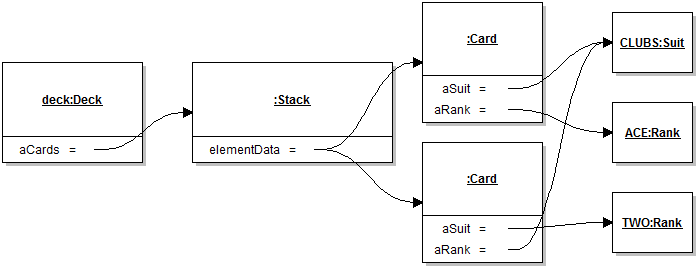
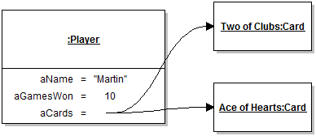

# Module 1 - Encapsulation

## Description

One of the major motivation for good design is to keep control of the complexity of a system. An idea that is paramount to simplifying the design of software is encapsulation. Ideally, classes serve to support functionality, but also to isolate distinct computations. This module will cover the most important concepts and techniques necessary to design well-encapsulated classes.

## Learning Objectives

After this module you should:

* Be able to explain the concepts of *encapsulation* and *information hiding*;
* Evaluate the quality of encapsulation realized by a single class;
* Know some of the programming language mechanisms and idioms that support encapsulation, and how to apply them;
* Understand the importance of *immutability* in software design and how to make Java classes immutable.
* Know about the concept of Design by Contract and how to apply it to Java programs using the `assert` statement;
* Know about *code style*, be able to explain how it contributes to code quality, and be able to apply a code-style checker and interpret its results;
* Be able to create and interpret Object Diagrams.

## Notes

### General Concepts and Definitions

The idea of **encapsulation** is to "to enclose in or as if in a capsule" [[Merriam-Webster](https://www.merriam-webster.com/dictionary/Encapsulation)]. For example, you can think of a nut, which is encapsulated in its shell. The shell, or capsule, serves as protection. In software design we encapsulate both data and computation both to protect them from corruption, and to simplify the design. Encapsulation in software design is related to the principle of **information hiding**, which has been around since the early 1970s. According to [Vogel et al.](http://link.springer.com/book/10.1007/978-3-642-19736-9) "The principle generally states that you only show a client that part of the total information that is really necessary for the client’s task and you hide all remaining information."

One of the first problems we will tackle in this module is to design an abstraction that can conveniently represent a single playing card. In a standard deck of cards there are 52 distinct cards and any given card can be completely defined by its *suit* (Hearts, Spades, Diamonds, Clubs) and its *rank* (Ace, 2, 3,...,10, Jack, Queen, King). In a program we can represent a playing card in many different ways. For example, using a single integer between 0 and 51 where the value of the integer somehow represents the card. Or, we could represent a card using a combination of 6 boolean values (insane but technically possible). Here to apply the principle of information hiding, we would organize our program structure so as to *hide* the decision of how exactly we represent a card in the program.

The fact that we can represent a card in many different ways is also a good illustration of the concept of a **design space**. The design space is an imaginary multi-dimensional vector space where every dimension corresponds to a design quality attribute (like understandability, reusability, ease of implementation, etc.). Within such a design space, each specific design decision corresponds to a point. The figure below illustrates the idea. Each decision is likely to be good in some dimension, but less good in others, something we call a **design trade-off**. Two sub-spaces of the design space that are useful to consider are the space of *possible solutions*, and the space of *acceptable solutions*. Note that the theoretically optimal solution, which best satisfies all dimensions at the same time, is unlikely to be possible. All this to say that design is a decision process for which there is rarely a single "right answer", only answers that are better or worse in some dimensions (including some answers that are pretty bad in most dimensions). In practice, the challenge of choosing a point in the design space is compounded by the fact that assessing the quality of a solution, even within a single dimension, is a very approximate process, and that we don't usually know what the optimal solution is. 


### Designing Basic Abstractions

One of the main activities of software design is to *define abstractions* using programming languages mechanisms. Ideally the abstractions we define will:

* clearly map to concepts in the problem domain (to facilitate program understanding)
* be well-encapsulated (see above)

One of the main mechanisms we use to define abstractions in type-based object-oriented languages is, not surprisingly, the *type*. 

Consider the following bad example:

```
int card = 0; // The ace of clubs
```

Here our decision is to use the integer primitive type as the abstraction to represent a playing card. Notice how this achieves neither of the two desirable properties above. The `int` type maps to the concept of integers (a type of number), not that of a playing card. You could rename the variable to `socialInsuranceNumber` while it still holds a value for a card, and achieve maximum confusion. It is also not well-encapsulated because you could assign the value 53 to the variable and corrupt it.

For this reason it's generally a bad idea to try to shoehorn domain concepts into default types like integer or string. The `int` type should only be used to hold actual integers (and very similar concepts, such as currency), and similarly with strings. 

In other cases we want to use our own type (or one defined by a library):

```
class Card {}
```

If we started to design this type, we would quickly realize that our program also needs to manipulate two other types of values: *suits* and *ranks*. These types of values are a bit different because they are more like labels for domain objects than actual objects. What makes them feel like labels are that there are a finite number of them for a particular type of values (e.g., 4 for suits), and it appears to be useless to have two or more instances representing a given suit (e.g., clubs). In fact values of these types would be used more or less as *constants* in a program.

```
private static int CLUBS = 0;
private static int HEARTS = 1;
...
```

There is a specific mechanism for representing these kinds of values called the [Enumerated Type](https://docs.oracle.com/javase/tutorial/java/javaOO/enum.html), or "enum types" for short. It's better to avoid the single colloquial term "enum" because it's not clear whether it refers to an enumerated type or a value of this type. Enumerated types are a truly powerful feature for software design, and I will use them extensively throughout this course. The one slight weakness of enumerated types in Java is that in addition to the enumerated values:

```
public enum Suit
{
	CLUBS, DIAMONDS, SPADES, HEARTS
}
```

a variable of an enumerated type can also take the value `null`:

```
Suit suit = Suit.CLUBS;
suit = null;
```

This is not a feature, but rather a consequence of how enumerated types are implemented in Java (as reference types). A good programming practice is to never consider the `null` value to be a legal value when using enumerated types.

### Basic Class Encapsulation Guidelines

The following guidelines, explained in class, will help you define well-encapsulated classes:

* Make all fields private. Later in the course I will describe how in some specific cases it may make sense to define them as `protected`. Extremely rarely is it desirable to leave them `public` or `packaged-scope` (default).
* Do not automatically supply a class with a "getter" (a.k.a. "accessor") and "setter" (a.k.a. "mutator") method for every field. 
* Try to avoid defining methods that both change ("mutate") the state of an object and return ("access") a value.
* Define your instance variables as `final` whenever possible. In Java the `final` designation for an instance or class variable indicates that it is not possible to re-assign (change) the value of the variable after it is initialized. However, remember that in Java values for references types are the references themselves, not the object they reference. This means that if the declared type for a final field is a reference type, although it will not be possible to assign the field to a different object, it will always be possible to change that object. More on this topic in Module 3.
* Make your classes **immutable** whenever possible. An *immutable* class generates instances whose state it is impossible to change. For example, instances of the class `String` cannot be modified, so they are immutable.
* Ensure your accessor methods do not return a reference to a mutable instance variable. In general, *it should never be possible to modify the internal state of an object without going through this object's instance methods*. If you need other objects to access instance variables that are held in mutable objects, return a copy of the object instead (see below). Note that values primitive types are copied by default.

### Scope 

A bit of important terminology about various variable *scopes* that impact encapsulation. A scope for a variable refers to the subset of the program where that variable is visible and can be accessed. At this point in the course it's useful to distinguish between three different scopes:

* **Global Scope**: Class variables (a.k.a. static fields) denoted as `public` can be accessed by any other part of the program, and are said to be *global*. Similarly, instance variables (a.k.a. non-static fields) denoted as `public` can be accessed by any part of the program that transitively has a reference to the corresponding instance. These are also considered to be in the global scope. Ideally very few elements should be in the global scope, if any.

* **Object Scope**: Instance variables (a.k.a. non-static fields) denoted as `private` can (only) be accessed by methods that take the same instance as implicit parameters (i.e., methods on the same object). These are considered to be in the object scope. The "object scope" is a useful concept for design, especially when considering the problem of escaping references (see below). However, the concept of an object scope is not supported by the Java language, which has a strictly static view of scopes. In Java, instances variables ("fields") are placed in the *class scope*, which approximates the idea of the object scope, but provides additional flexibility when implementing things like copy constructors (or the `equals` method, something we will see later). Consider the code below:

```
public class Card
{
	private Rank aRank;
	private Suit aSuit;

	public Card( Card pCard )
	{
		aRank = pCard.aRank;
		aCard = pCard.aSuit;
	}
	...
```

Here the code in the constructor can see the private `aRank` and `aSuit` fields of a *different* `Card` object, because the references happen between members of the same class. This situation can be a bit confusing at first, but it's good to remember that it's somewhat of a special case. For all the code except the methods of `Card`, the object scope and the class scope will overlap. 
	

* **Local Scope**: Local variables are only accessible within their immediately encompassing block scope (in most cases that is the innermost set of curly braces encompassing the variable definition. Locals variables are obviously restricted to their local scope, but also formal method parameters, exception variables, etc.

* **Other Scopes**: There are other scopes to consider for more advanced design problems, including package scope, class-hierarchy scope, scopes for closures, etc. These will be introduced as necessary. For Module 1 only the three basic scopes are relevant.


One of the ways we can achieve good encapsulation is to always define variables in the tightest scope possible. Unfortunately, in Java values can **escape their scope**, and it's our job as a good programmer to make sure they can't. Here's are the four typical routes of escape in Java, illustrated with the code below for object scopes.

* **There is no door:** If a variable is in the global scope, it escapes by default because it is not contained. This is somewhat of a degenerate case.
* **The front door is open:**: If an accessor method returns a reference to an instance variable in the object scope, the reference escapes the object scope. One solution here is to copy the object before returning it.
* **The door was not closed:** If an instance variable is assigned a value obtained from a parameter, the caller of the method retains a reference to the object, which means the value is not properly captured by the object scope. One solution here is to copy the object before assigning it.
* **The back door is open:** If a reference to an instance variable is stored within an object that can be referenced from outside the object scope, then the reference escapes the object score. One solution here is to copy the object before storing it in the provided data structure, but often this kind of convoluted design can be improved to avoid the problem in the first place.

```
public class Deck
{
	/* There is no door */
	public Stack<Card> aCards = new Stack<>();
	
	/* The front door is open */
	public Stack<Card> getCards()
	{ return aCards; }
	
	/* The door was not closed */
	public void setStack(Stack<Card> pCards)
	{ aCards = pCards; }
	
	/* The back door is open */
	public void applyAll( List<Stack<Card>> pTaskList )
	{ pTaskList.add(aCards); }
}
```

### Design by Contract

The idea of [Design by Contract](https://en.wikipedia.org/wiki/Design_by_contract) is to follow a principled approach to the specification of interfaces. Although in practice, method signatures already specify much of what is needed, they also leave a lot of room for ambiguity.

A typical case where Design by Contract is useful is to specify whether `null` is a legal input or not. Consider the following constructor for a `Card` class:

```
public class Card
{
	public Card(Rank pRank, Suit pSuit)
	{
		...
```

Is it legal to pass in a `null` value for `pRank` and/or `pSuit`? Maybe, maybe not. A helpful programmer could put this in the Javadocs, which is better than nothing. Design by Contract goes further and provides a formal framework for reasoning about this kind of interface information. There's a lot to say about Design by Contract. Here I only summarize what I use in the course.

The idea of Design by Contract is for method signatures (and complementary meta-data) to provide a sort of "contract" between the "client" (the caller method) and the "server" (the method being called). This contract takes the form of a set of **preconditions** and a set of **postconditions**. Given these, the contract is basically that *the method can only be expected to conform to the postconditions if the caller conforms to the preconditions*. If a client calls a method without respecting the preconditions, the behavior of the method is **unspecified**. In practice Design by Contract is a great way to force us to think about all possible ways to use a method.

In this course I adopt a lightweight version of Design by Contract where preconditions are specified using Java statements in the Javadoc using the `@pre` tag and, more rarely, postconditions are specified using the tag `@post`. 

```
	/**
	 * ...
	 * @pre pRank != null && pSuit != null
	 */
	public Card(Rank pRank, Suit pSuit)
	{
		...
```

It is possible to make pre- and postconditions (and any other predicate) *checkable* in Java using the `assert` statement:

```
assert pRank != null && pSuit != null;
```

The `assert` statement evaluates the predicate in the statement and raises an `AssertionError` if the predicate evaluates to false. Unfortunately assertion checking is disabled by default in Java, so to use this properly you must add `-ea` (enable assertions) as a VM parameter when running Java programs.

Correctly implemented, Design by Contract helps prevent the annoying idiom of [defensive programming](https://en.wikipedia.org/wiki/Defensive_programming) where corner cases (such as null values) are checked for everywhere in the code. Additionally, the technique supports rapid *blame assignment* while debugging: If a precondition check fails, the client (caller method) is to blame. If a postcondition check fails, the actual method being called is to blame.

More generally, `assert` statements are a simple yet very powerful tool to increase code quality and I encourage you to use it everywhere, not just for pre- and postconditions. Whenever an assertion check fails, you know exactly where the problem is, and thus can save hours of debugging time.

A final note about Design by Contract is that the addition of preconditions to a method interface actually relieves us of the requirement to handle the condition. So the code below is *not properly designed* because it *both* states that null values are not a valid input *and* handles them in a consistent way (by raising an exception). If a method checks
for a certain type of input (like null values) and produces a well-defined behavior as the result, then this is part
of the official interface specification! When designing method interfaces, it is important to decide whether the method will be in charge of rejecting illegal values, or whether these will simply be specified as invalid. These are two different design choices.

```
	/**
	 * ...
	 * @pre pRank != null && pSuit != null
	 */
	public Card(Rank pRank, Suit pSuit) 
	{
		if( pRank != null || pSuit != null ) throw new IllegalArgumentException()
		...
```

### Exposing Encapsulated Information

In a great majority of cases the objects of the classes we design will need to expose part of the information they encapsulate to other objects. How can we do this without breaking encapsulation, and in particular the cardinal rule that *it should never be possible to modify the internal state of an object without going through this object's instance methods*.

If the internal objects that need to be exposed are *immutable*, then there's no issue. For example, a `Card` object returns its rank:

```
public class Card
{
	Rank aRank = ...;
	
	public Rank getRank()
	{
		return aRank;
	}
	...
```

but the value returned is of the enumerated type `Rank`, which is immutable, so even if the reference to `aRank` is allowed to escape the object scope, whatever other parts of the program get a hold of it can't do anything to the `Rank` object that is referenced, so, it's all good.

But what if the object that is referenced is *mutable*, as in the case of the stack encapsulated by a `Deck` class?

```
public class Deck
{
	private final Stack<Card> aCards = new Stack<>();
```

If *it is really necessary* to provide information about the stack to other objects, we don't want to do this by returning a reference to the mutable stack. Several options are possible:

* To add methods to the `Deck` class that allow querying the state of the deck in a safe way. For example, by adding methods like `isEmpty()`, `size()`, `elementAt()`, etc. This strategy will be covered in more details in Module 2.
* To return an immutable wrapper for the collection using library methods such as `java.util.Collections.unmodifiableList(...)`. This strategy will be covered in more details in Module 5.
* To return a copy of the collection. 

[Copying objects](https://en.wikipedia.org/wiki/Object_copying) is one way to help design well-encapsulated classes, but it can be a complex topic. There are different ways to copy objects in Java, each with their strengths and weaknesses:

* To use the idiom of **copy constructors**;
* To use Java's special-purpose *cloning* mechanism;
* To use features such as serialization or reflection.

Here we focus on copy constructors. The other strategies require more advanced material and their coverage is deferred to later modules.

A copy constructor is simply a constructor that takes in a parameter of the same type as the class whose objects should be copied, and copies the 
information from the argument object to the invoked object. For example for a `Card`:

```
public class Card
{
	private Rank aRank;
	private Suit aSuit;
	
	/** Copy constructor */
	public Card( Card pCard )
	{
		aRank = pCard.aRank;
		aSuit = pCard.aSuit;
	}
}
```

It's good to know that many Java collection classes support a kind of copy constructor, for example [ArrayList](http://docs.oracle.com/javase/8/docs/api/java/util/ArrayList.html#ArrayList-java.util.Collection-);

Copying collections is a tricky topic because it requires various design decisions about the *depth* of the copy. Here it is assumed that the concepts of *shallow* vs. *deep* copying were adequately covered in the prerequisite courses, but the Wikipedia article on [object copying](https://en.wikipedia.org/wiki/Object_copying) provides a refresher, and we will cover this topic in more depth in Module 3.

### The Unified Modeling Language

There will often be situations where we need to discuss various design problems and solutions that are too complex 
or inconvenient to describe using either source code or natural language. For this purpose we can use the [Unified Modeling Language](https://en.wikipedia.org/wiki/Unified_Modeling_Language), or UML. The UML consists in a modeling language 
roughly organized in terms of different types of *diagrams* that are a great way to illustrate different aspects of software without getting bogged down with all the details. They are also a language specialized for describing software design, a bit like musical notation is a language specialized for music. Try describing your favorite melody using only written English text: it's a similar idea with software.

Different people use UML in different ways for different reasons. For example, UML can be used to produce formal design documentation in Waterfall-type development processes. Others use UML to describe enough of the software to be able to automatically generate the code from the models. In COMP 303 I use UML simply for *communicating ideas about design*. The models we produce in this course are not expected to be formal or automatically transformable into code. I also use the smallest subset of the
modeling language possible to cover the course material. 

A very important thing to remember about UML diagrams, is that they are *models*. This means that they are not intended to capture
every single little details of a solution. Ideally, a UML diagram should focus on illustrating a *single main idea* and only include the relevant information. In UML diagramming it is a common practice to leave the parts of a system that are not directly relevant to the point being illustrated. 

In this course I will do all my diagramming with [JetUML](http://cs.mcgill.ca/~martin/jetuml/). 

### Object Diagrams

Object diagrams represent an existing graph of objects, or class *instances*. In Java, whenever a `new` statement is executed, an object is created and a reference to this object is returned and passed around. It can often be useful to visually represent the resulting graph of objects and their inter-dependent references.

In an Object Diagram a rectangle represents an object instance, with its name and type indicated as `name:type`. Both name and type information are optional, but in general it's useful to have at least one of the two. By convention in UML the name of objects (as opposed to classes) are underlined in all diagrams. Objects can contain *fields*, which are just like Java fields. They can contain a primitive value or a value that is a reference to another object. References are represented as arrows to whatever they refer to.

Consider the diagram below:



This diagram models an instance of the `Deck` class named `deck`. It would have been fine to omit this name and simply indicate `:Deck` in the rectangle, as in the case of `Stack`. This `deck` has a field `aCards` whose current value is a reference to a `Stack` object. The `Stack` object's `elementData` field references two `Card` objects. Here notice how, through modeling, we can skip over some useless details. In actual reality, in a `java.util.Stack` instance the `elementData` field refers to an array of `Object` types whose cells contain the actual data. This information is not useful here, and we link directly to the contained data. Note how the stack refers to two cards, and not 3 or 4 or 52. Another important point about Object Diagrams is that they represent a *snapshot in the execution of a program*. Here it was the point where the stack had two cards. An alternative explanation is that we didn't think it was useful to include all 52 cards to make the point that a deck is a stack of cards. The two `Card` instances, however, are modeled in full detail. Note how the values of enumerated types are distinguished by name, as it should, and that enumerated value `Suit.CLUBS` is *shared* between two cards. I will cover reference sharing in more detail in Module 3.

The second sample diagram, below, illustrates some of the modeling simplifications we can do, when appropriate.



Here the field `aName`, clearly of type `String`, has the string represented as if it were a value of a primitive type. To be completely accurate down to the last detail, the value should be a reference to an instance of class `String` that has a reference to an array of `char` objects, each with one letter. That level of detail would be both superfluous and counter-productive to the goal of indicating that a `Player` object stores name information. In this second diagram, we also see that a player somehow keeps track of a number of cards, but how these are stored internally is not represented. The cards could be in an array, a list, a set, whatever. In this case it was not judged necessary to include this information. Finally, and this is maybe a bit of a stretch, the value of the `Card` instances are represented artificially by using an evocative name for the objects, instead of modeling the field values. This doesn't mean that these `Card` instances somehow don't have the `aRank` and `aSuit` fields, it just means this detail has been elided on the diagram.

## Reading
* Textbook 3.1-3.6
* The Java Tutorial on [Enumerated Types](https://docs.oracle.com/javase/tutorial/java/javaOO/enum.html)
* Solitaire v0.1 [Card.java](https://github.com/prmr/Solitaire/blob/v0.1/src/ca/mcgill/cs/stg/solitaire/cards/Card.java)
* Solitaire v0.1 [Deck.java](https://github.com/prmr/Solitaire/blob/v0.1/src/ca/mcgill/cs/stg/solitaire/cards/Deck.java)
* JetUML v1.0 [MultiLineString](https://github.com/prmr/JetUML/blob/v1.0/src/ca/mcgill/cs/stg/jetuml/framework/MultiLineString.java)

## Exercises

For maximum learning effectiveness, I recommend peeking at the [answers](answers/Answers-01.md) only after giving the problems an honest try.

0. Implement class `Card` as a single enumerated type. For the purpose of the Solitaire application, does this look like a superior or inferior solution to version 7 of class `Card` seen in class? Why? Try writing down your answer in specific terms using terminology seen in the course. This will be an excellent practice for the exams.
0. Extend the `Suit` enumerated type in `Card` to include a method `color()` that returns the color of the suit. The return type should be a new enumerated type `Color`.
0. Extend version 7 of class `Card` to support the concept of a "Joker" (a special card that is not in any suit) while keeping the class as well-encapsulated as possible.
0. Further extend your class to support any number of distinct jokers. For example, a "high" joker vs. a "low" joker, or even three jokers, etc. Again, try to keep things well-encapsulated and respectful of the class design guidelines seen in the reading.
0. Add a method `getCards()` to the `Deck` class that returns the cards in the deck without breaking encapsulation.
0. Create a new class called `MultiDeck` that contains a list of decks (some card games require multiple decks). Make the class copyable through a copy constructor. First, make a shallow copy of the decks contained. Use the debugger to confirm that the decks in a multi-deck are shared between an original multi-deck and its copies. Then, use deep copying to make copied multi-decks fully distinct object graphs. Use Design by Contract and the `assert` statement to clarify the class's interface.
0. Create a UML Object Diagram of a `MultiDeck` instance.
0. Study JetUML's [MultiLineString](https://github.com/prmr/JetUML/blob/v1.0/src/ca/mcgill/cs/stg/jetuml/framework/MultiLineString.java) class and assess the quality of its encapsulation. Is it possible to modify its state without going through its methods?

---

<a rel="license" href="http://creativecommons.org/licenses/by-nc-nd/4.0/"></a>

Unless otherwise noted, the content of this repository is licensed under a <a rel="license" href="http://creativecommons.org/licenses/by-nc-nd/4.0/">Creative Commons Attribution-NonCommercial-NoDerivatives 4.0 International License</a>. 

Copyright Martin P. Robillard 2017