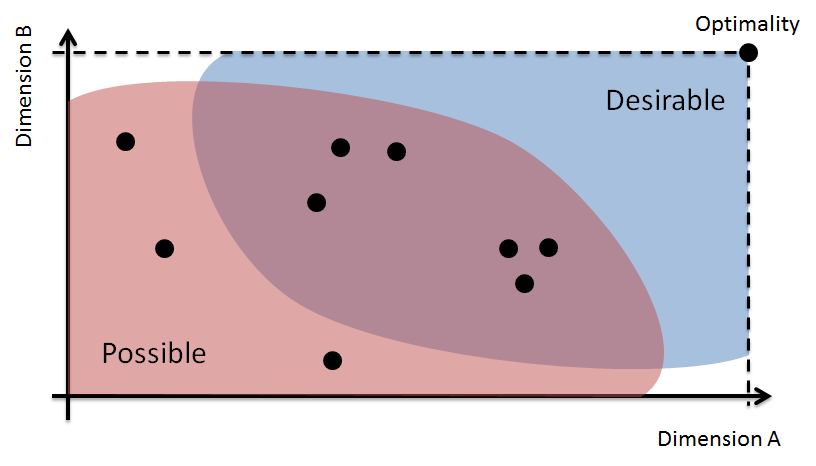

# Module 1 - Encapsulation

## Description

One of the major motivation for good design is to keep control of the complexity of a system. An idea that is paramount to simplifying the design of software is encapsulation. Ideally, classes serve to support functionality, but also to isolate distinct computations. This module will cover the most important concepts and techniques necessary to design well-encapsulated classes.

## Learning Objectives

After this module you should:

* Be able to explain the concepts of *encapsulation* and *information hiding*;
* Evaluate the quality of encapsulation realized by a single class;
* Know some of the programming language mechanisms and idioms that support encapsulation, and how to apply them;
* Understand the importance of *immutability* in software design and how to make Java classes immutable.
* Know about the concept of Design by Contract and how to apply it to Java programs using the assert statement;
* Know about *code style*, be able to explain how it contributes to code quality, and be able to apply a code-style checker and interpret its results;
* Be able to create and interpret Object Diagrams.

## Notes

### General Concepts and Definitions

The idea of **encapsulation** is to "to enclose in or as if in a capsule" [[Merriam-Webster](https://www.merriam-webster.com/dictionary/Encapsulation)]. For example, you can think of a nut, which is encapsulated in its shell. The shell, or capsule, serves as protection. In software design we encapsulate both data and computation both to protect them from corruption, and to simplify the design. Encapsulation in software design is related to the principle of **information hiding**, which has been around since the early 1970s. According to [Vogel et al.](http://link.springer.com/book/10.1007/978-3-642-19736-9) "The principle generally states that you only show a client that part of the total information that is really necessary for the client’s task and you hide all remaining information."

One of the first problem we will tackle in this module is to design an abstraction that can conveniently represent a single playing card. In a standard deck of cards there are 52 distinct cards and any given card can be completely defined by its *suit* (Hearts, Spades, Diamonds, Clubs) and its *rank* (Ace, 2, 3,...,10, Jack, Queen, King). In a program we can represent a playing card in many different ways. For example, using a single integer between 0 and 51 where the value of the integer somehow represents the card. Or, we could represent a card using a combination of 8 boolean values (insane but technically possible). Here to apply the principle of information hiding, we would organize our program structure so as to *hide* the decision of how exactly we represent a card in the program.

The fact that we can represent a card in many different ways is also a good illustration of the concept of a **design space**. The design space is an imaginary multi-dimensional vector space where every dimension corresponds to a design quality attribute (like understandability, reusability, ease of implementation, etc.). Within such a design space, each specific design decision corresponds to a point. The figure below illustrates the idea. Each decision is likely to be good in some dimension, but less good in others, something we call a **design trade-off**. Two sub-spaces of the design space that are useful to consider are the space of *possible solutions*, and the space of *acceptable solutions*. Note that the theoretically optimal solution, which best satisfies all dimensions at the same time, is unlikely to be possible. All this to say that design is a decision process for which there is rarely a single "right answer", only answers that are better or worse in some dimensions (including some answers that are pretty bad in most dimensions). In practice, the challenge of choosing a point in the design space is compounded by the fact that assessing the quality of a solution, even within a single dimension, is a very approximate process, and that we don't usually know what the optimal solution is.

<!--
* Programming language types play a big role in helping to encapsulate abstractions. String vs in vs enum
* Enum types
* Object copying idiom
* Object encapsulation: It should not be possible to change an object state without going through its methods
* Design by contract
* Scopes and escaping references
* Object diagrams
* Immutability, final fields
* Collection copying -->

## Reading
* Textbook 3.1-3.6
* Solitaire v0.1 [Card.java](https://github.com/prmr/Solitaire/blob/v0.1/src/ca/mcgill/cs/stg/solitaire/cards/Card.java)
* Solitaire v0.1 [Deck.java](https://github.com/prmr/Solitaire/blob/v0.1/src/ca/mcgill/cs/stg/solitaire/cards/Deck.java)

## Exercises

---

Unless otherwise noted, the content of this repository is licensed under a <a rel="license" href="http://creativecommons.org/licenses/by-nc-nd/4.0/">Creative Commons Attribution-NonCommercial-NoDerivatives 4.0 International License</a>. 

Copyright Martin P. Robillard 2017