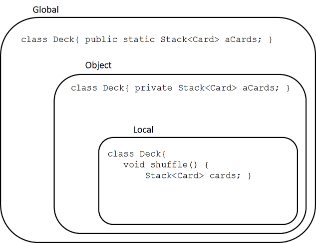

# Module 1 - Encapsulation

## Description

One of the major motivation for good design is to keep control of the complexity of a system. An idea that is paramount to simplifying the design of software is encapsulation. Ideally, classes serve to support functionality, but also to isolate distinct computations. This module will cover the most important concepts and techniques necessary to design well-encapsulated classes.

## Learning Objectives

After this module you should:

* Be able to explain the concepts of *encapsulation* and *information hiding*;
* Evaluate the quality of encapsulation realized by a single class;
* Know some of the programming language mechanisms and idioms that support encapsulation, and how to apply them;
* Understand the importance of *immutability* in software design and how to make Java classes immutable.
* Know about the concept of Design by Contract and how to apply it to Java programs using the assert statement;
* Know about *code style*, be able to explain how it contributes to code quality, and be able to apply a code-style checker and interpret its results;
* Be able to create and interpret Object Diagrams.

## Notes

### General Concepts and Definitions

The idea of **encapsulation** is to "to enclose in or as if in a capsule" [[Merriam-Webster](https://www.merriam-webster.com/dictionary/Encapsulation)]. For example, you can think of a nut, which is encapsulated in its shell. The shell, or capsule, serves as protection. In software design we encapsulate both data and computation both to protect them from corruption, and to simplify the design. Encapsulation in software design is related to the principle of **information hiding**, which has been around since the early 1970s. According to [Vogel et al.](http://link.springer.com/book/10.1007/978-3-642-19736-9) "The principle generally states that you only show a client that part of the total information that is really necessary for the client’s task and you hide all remaining information."

One of the first problem we will tackle in this module is to design an abstraction that can conveniently represent a single playing card. In a standard deck of cards there are 52 distinct cards and any given card can be completely defined by its *suit* (Hearts, Spades, Diamonds, Clubs) and its *rank* (Ace, 2, 3,...,10, Jack, Queen, King). In a program we can represent a playing card in many different ways. For example, using a single integer between 0 and 51 where the value of the integer somehow represents the card. Or, we could represent a card using a combination of 8 boolean values (insane but technically possible). Here to apply the principle of information hiding, we would organize our program structure so as to *hide* the decision of how exactly we represent a card in the program.

The fact that we can represent a card in many different ways is also a good illustration of the concept of a **design space**. The design space is an imaginary multi-dimensional vector space where every dimension corresponds to a design quality attribute (like understandability, reusability, ease of implementation, etc.). Within such a design space, each specific design decision corresponds to a point. The figure below illustrates the idea. Each decision is likely to be good in some dimension, but less good in others, something we call a **design trade-off**. Two sub-spaces of the design space that are useful to consider are the space of *possible solutions*, and the space of *acceptable solutions*. Note that the theoretically optimal solution, which best satisfies all dimensions at the same time, is unlikely to be possible. All this to say that design is a decision process for which there is rarely a single "right answer", only answers that are better or worse in some dimensions (including some answers that are pretty bad in most dimensions). In practice, the challenge of choosing a point in the design space is compounded by the fact that assessing the quality of a solution, even within a single dimension, is a very approximate process, and that we don't usually know what the optimal solution is.


### Designing Basic Abstractions

One of the main activities of software design is to *define abstractions* using programming languages mechanisms. Ideally the abstractions we define will:

* clearly map to concepts in the problem domain (to facilitate program understanding)
* be well-encapsulated (see above)

One of the main mechanisms we use to define abstractions in type-based object-oriented languages is, not surprisingly, the *type*. 

Consider the following bad example:

```
int card = 0; // The ace of clubs
```

Here our decision is to use the integer primitive type as the abstraction to represent a playing card. Notice how this achieves neither of the two desirable properties above. The `int` type maps to the concept of integers (a type of number), not that of a playing card. You could rename the variable to `socialInsuranceNumber` while it still holds a value for a card, and achieve maximum confusion. It is also not well-encapsulated because you could assign the value 53 to the variable and corrupt it.

For this reason it's generally a bad idea to try to shoehorn domain concepts into default types like integer or string. The `int` type should only be used to hold actual integers (and very similar concepts, such as currency), and similarly with strings. 

In other cases we want to use our own type (or one defined by a library):

```
class Card {}
```

If we started to design this type, we would quickly realize that our program also needs to manipulate two other types of values: *suits* and *ranks*. These types of values are a bit different because they are more like labels for domain objects than actual objects. What makes them feel like labels are that there are a finite number of them for a particular type of values (e.g., 4 for suits), and it appears to be useless to have two or more instances representing a given suit (e.g., clubs). In fact values of these types would be used more or less as *constants* in a program.

```
private static int CLUBS = 0;
private static int HEARTS = 1;
...
```

There is a specific mechanism for representing these kinds of values called the [Enumerated Type](https://docs.oracle.com/javase/tutorial/java/javaOO/enum.html), or "enum types" for short. It's better to avoid the single colloquial term "enum" because it's not clear whether it refers to an enumerated type or a value of this type. Enumerated types are a truly powerful feature for software design, and I will use them extensively throughout this course. The one slight weakness of enumerated types in Java is that in addition to the enumerated values:

```
public enum Suit
{
	CLUBS, DIAMONDS, SPADES, HEARTS
}
```

a variable of an enumerated type can also take the value `null`:

```
Suit suit = Suit.CLUBS;
suit = null;
```

This is not a feature, but rather a consequence of how enumerated types are implemented in Java (as reference types). A good programming practice is to never consider the `null` value to be a legal value when using enumerated types.

### Basic Class Encapsulation Guidelines

The following guidelines, explained in class, will help you define well-encapsulated classes:

* Make all fields private. Later in the course I will describe how in some specific cases it may make sense to define them as `protected`. Extremely rarely is it desirable to leave them `public` or `packaged-scope` (default).
* Do not automatically supply a class with a "getter" (a.k.a. "accessor") and "setter" (a.k.a. "mutator") method for every field. 
* Try to avoid defining methods that both change ("mutate") the state of an object and return ("access") a value.
* Define your instance variables as `final` whenever possible. In Java the `final` designation for an instance or class variable indicates that it is not possible to re-assign (change) the value of the variable after it is initialized. However, remember that in Java values for references types are the references themselves, not the object they reference. This means that if the declared type for a final field is a reference type, although it will not be possible to assign the field to a different object, it will always be possible to change that object. More on this topic in Module 3.
* Make your classes **immutable** whenever possible. An *immutable* class generates instances whose state it is impossible to change. For example, instances of the class `String` cannot be modified, so they are immutable.
* Ensure your accessor methods do not return a reference to a mutable instance variable. In general, *it should never be possible to modify the internal state of an object without going through this object's instance methods*. If you need other objects to access instance variables that are held in mutable objects, return a copy of the object instead (see below). Note that values primitive types are copied by default.

### Scope 

A bit of important terminology about various variable *scopes* that impact encapsulation in Java. 

* **Global Scope**: Class variables (a.k.a. static fields) denoted as `public` can be accessed by any other part of the program, and are said to be *global*. Similarly, instance variables (a.k.a. non-static fields) denoted as `public` can be accessed by any part of the program that transitively has a reference to the corresponding instance. These are also considered to be in the global scope. Ideally very few elements should be in the global scope, if any.

* **Object Scope**: Instance variables (a.k.a. non-static fields) denoted as `private` can (only) be accessed by methods that take the same instance as implicit parameter (i.e., methods on the same object). These are considered to be in the object scope.

* **Local Scope**: Local variables are only accessible within their immediately encompassing block scope (in most cases that is the innermost set of curly braces encompassing the variable definition. Locals variables are obviously restricted to their local scope, but also formal method parameters, exception variables, etc.

* **Other Scopes**: There are other scopes to consider for more advanced design problems, including package scope, class-hierarchy scope, scopes for closures, etc. These will be introduced as necessary. For Module 1 only the three basic scopes are relevant.



One of the ways we can achieve good encapsulation is to always define variables in the tightest scope possible. Unfortunately, in Java values can **escape their scope**, and it's our job as a good programmer to make sure they can't. Here's are the four typical routes of escape in Java, illustrated with the code below for object scopes.

* **There is no door:** If a variable is in the global scope, it escapes by default because it is not contained. This is somewhat of a degenerate case.
* **The front door is open:**: If an accessor method returns a reference to an instance variable in the object scope, the reference escapes the object scope. One solution here is to copy the object before returning it.
* **The door was not closed:** If an instance variable is assigned a value obtained from a parameter, the caller of the method retains a reference to the object, which means the value is not properly captured by the object scope. One solution here is to copy the object before assigning it.
* **The back door is open:** If a reference to an instance variable is stored within an object that can be referenced from outside the object scope, then the reference escapes the object score. One solution here is to copy the object before storing it in the provided data structure, but in often this kind of convoluted design is can be improved to avoid the problem in the first place.

```
public class Deck
{
	/* There is no door */
	public Stack<Card> aCards = new Stack<>();
	
	/* The front door is open */
	public Stack<Card> getCards()
	{ return aCards; }
	
	/* The door was not closed */
	public void setStack(Stack<Card> pCards)
	{ aCards = pCards; }
	
	/* The back door is open */
	public void applyAll( List<Stack<Card>> pTaskList )
	{ pTaskList.add(aCards); }
}
```

### Copying Objects

To be completed

### Design by Contract

To be completed

### UML Object Diagrams

To be completed

## Reading
* Textbook 3.1-3.6
* The Java Tutorial on [Enumerated Types](https://docs.oracle.com/javase/tutorial/java/javaOO/enum.html)
* Solitaire v0.1 [Card.java](https://github.com/prmr/Solitaire/blob/v0.1/src/ca/mcgill/cs/stg/solitaire/cards/Card.java)
* Solitaire v0.1 [Deck.java](https://github.com/prmr/Solitaire/blob/v0.1/src/ca/mcgill/cs/stg/solitaire/cards/Deck.java)
* JetUML v1.0 [MultiLineString](https://github.com/prmr/JetUML/blob/v1.0/src/ca/mcgill/cs/stg/jetuml/framework/MultiLineString.java)

## Exercises

0. Implement class `Card` as a single enumerated type. For the purpose of the Solitaire application, does this look like a superior or inferior solution to version 7 of class `Card` seen in class? Why? Try writing down your answer in specific terms using terminology seen in the course. This will be an excellent practice for the exams.
0. Extend version 7 of class `Card` to support the concept of a "Joker" (a special card that is not in any suit) while keeping the class as well-encapsulated as possible.
0. Further extend your class to support any number of distinct jokers. For example, a "high" joker vs. a "low" joker, or even three jokers, etc. Again, try to keep things well-encapsulated and respectful of the class design guidelines seen in the reading.
0. Add a method `getCards()` to the `Deck` class that returns the cards in the deck without breaking encapsulation.
0. Create a new class called `MultiDeck` that contains a list of decks (some card games require multiple decks). Make the class copyable through a copy constructor. First, make a shallow copy of the decks contained. Use the debugger to confirm that the decks in a multi-deck are shared between an original multi-deck and its copies. Then, use deep copying to make copied multi-decks fully distinct object graphs. Use Design by Contract and the `assert` statement to clarify the class's interface.
0. Create a UML Object Diagram of a `MultiDeck` instance.
0. Study JetUML's [MultiLineString](https://github.com/prmr/JetUML/blob/v1.0/src/ca/mcgill/cs/stg/jetuml/framework/MultiLineString.java) class and assess the quality of its encapsulation. Is it possible to modify its state without going through its methods?

---

<a rel="license" href="http://creativecommons.org/licenses/by-nc-nd/4.0/"></a>

Unless otherwise noted, the content of this repository is licensed under a <a rel="license" href="http://creativecommons.org/licenses/by-nc-nd/4.0/">Creative Commons Attribution-NonCommercial-NoDerivatives 4.0 International License</a>. 

Copyright Martin P. Robillard 2017