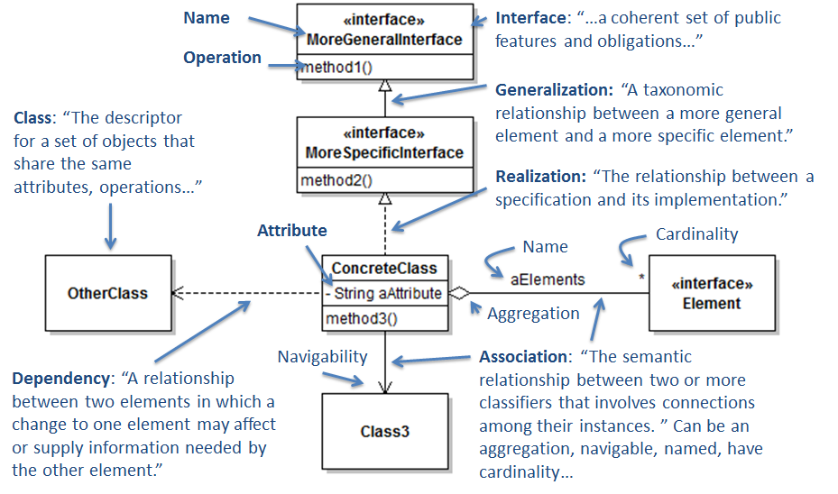
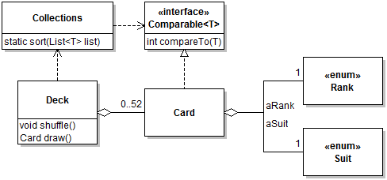
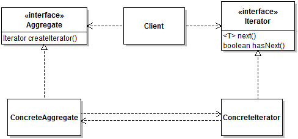
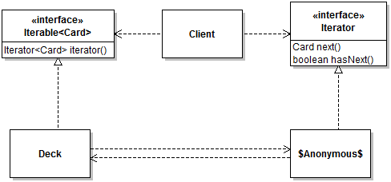
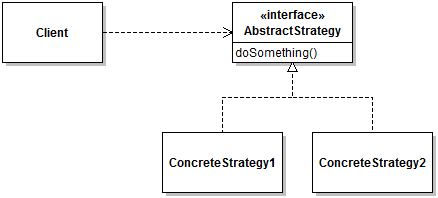
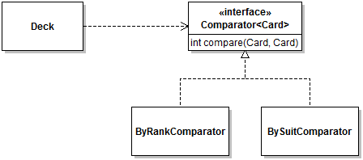
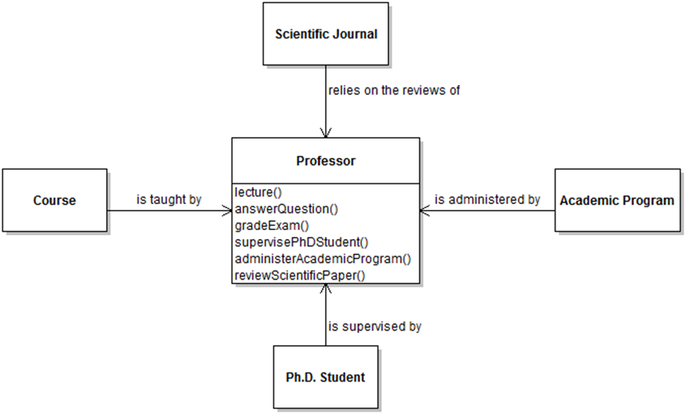
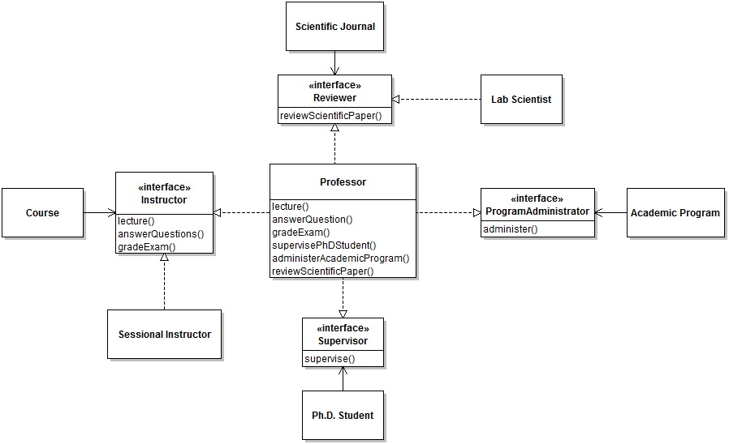

# Module 2 - Types and Polymorphism

## Description

One of the main mechanisms at our disposal for designing object-oriented applications is *polymorphism*, which in the case of Java and similar languages is heavily tied to the notion of a type system. In this module I will do a brief review of the foundations of polymorphism, introduce the idea of interface programming, and present common low-level design problems that are easily solved with polymorphism.

## Learning Objectives

After this module you should:

* Be able to explain the concept of subtype polymorphism in object-oriented programming;
* Understand and be able to use the Interface Segregation Principle;
* Be able to create and interpret UML Class Diagrams;
* Know the difference between an interface type and a class's interface;
* Be able to implement existing interfaces to provide required functionality;
* Understand the ideas of anonymous classes and function objects and be able to use them effectively;
* Know about the concept of Design Patterns;
* Be able to effectively use the *Iterator* and *Strategy* design patterns;
* Know and be able to effectively use some of the common Java utility interfaces, including `Comparable` and `Comparator`.

## Notes

### General Concepts and Definitions

In Module 1 we saw how to define well-encapsulated classes, but conveniently left out the question of how objects of these classes would interact. In Module 2 we start facing this question. Interactions between objects are mediated through *interfaces*. The term "interface" is heavily overloaded in programming: it can have different meanings depending on the context. 

An **interface to a class or to an object** consists of the methods of that class (or of the object's class) that are *accessible* to another class or object. What methods are *accessible* depends on the *scoping rules* that apply to a class member. In the context of Module 2 we will keep things simple and assume that the interface to a class or object is the set of its public methods. This is not strictly true, but for Module 2 we don't need the additional distinctions. Note that I refer to the interface of a *class or object*. This simply means that the concept of interface applies to both. If we're thinking of a design solution in terms of class definitions, then the interface is that of the class. If we're thinking of a design solution in terms of a collection of instantiated objects of the class, then it's the object's interface that's relevant. We will revisit this duality in Module 3.

Consider the following program:

```java
class Game
{
   Deck aDeck;
   ...
	
public final class Deck
{
   private  Stack<Card> aCards = new Stack<>();
   ...
   public Deck( Deck pDeck ) {...}
   public void shuffle() {...]
   public Card draw() {...}
   public boolean isEmpty() {...}
}
```

Here the interface of class `Deck` consists of a constructor and three methods. The code in other classes can interact with objects of class `Deck` by calling these and only these methods. Here we would say that the interface of class `Deck` is *fused with the class definition*. In other words, the interface of class `Deck` is just a consequence of how we defined class `Deck`: there is no way to get the three services that correspond to the three methods of the class, without interacting with an instance of class `Deck`.

There are, however, many situations were we want to *decouple* the interface of a class from its implementation. These are situations where we want to design the system so one part of the program can depend on the availability of some services, without being tied to the exact details of how these services are implemented.

Consider the case of manipulating icons in a program:

```java
class Game
{
   Icon aIcon = ...;
	
   public void showIcon()
   {
      if(aIcon.getIconWidth() > 0 && aIcon.getIconHeight() > 0 )
      {
         aIcon.paintIcon(...);
      }
   }
...
```

In practice, the information representing an icon can come from different types of sources, including image files of different formats and [algorithms that compute image information on the fly](https://github.com/prmr/JetUML/blob/v1.0/src/ca/mcgill/cs/stg/jetuml/framework/ToolBar.java#L129). In this and similar cases, it is extremely useful to be able to specify an interface without tying it to a specific class. This is where **Java interfaces** come in.

In Java, interfaces provide a **specification** of the methods that it should be possible to invoke on the objects of a class. For instance the interface [Icon](http://docs.oracle.com/javase/8/docs/api/javax/swing/Icon.html) *specifies* three method signatures and documents their expected behavior.

To tie a class with an interface, we use the `implements` keyword.

```java
public class ImageIcon implements Icon
```

The `implements` keyword has two related meanings:

* It provides a formal guarantee that instances of the class type will have concrete implementations for all the methods in the interface type. This guarantee is enforced by the compiler.
* It creates a **subtype** ("is-a") relationship between the implementing class and the interface type: here we can now say than an `ImageIcon` "is-a" type of `Icon`.

The subtype relation between a concrete class and an interface is what enables the use of [polymorphism](https://en.wikipedia.org/wiki/Polymorphism_(computer_science)). In plain language, polymorphism is the ability to have different shapes. Here, an abstractly specified `Icon` can have different concrete shapes that correspond to the different implementations of the `Icon` interface. For polymorphism to make sense in the context of a Java program it's important to remember that according to the rules of the Java type system it is possible to assign a value to a variable if the value is of the same type *or a subtype* of the type of the variable. Because the interface implementation relation defines a subtype relation, concrete classes declared to implement an interface can be assigned to variables declared to be of the interface type. Another illustration of the use of polymorphism is the use of concrete vs. abstract collection types:

```java
List<String> list = new ArrayList<>();
```

Here `List` is an interface that specifies the obvious services (add, remove, etc.), and `ArrayList` is a concrete implementation of this service. But we can just as well replace `ArrayList` with `LinkedList` and the code will still compile. Even though the details of the list implementation differ between `ArrayList` and `LinkedList`, they both provide exactly the methods required by the `List` interface, so it's permissible to swap them.

Polymorphism as supported by Java interfaces supports two very useful quality features in software design:
* **Loose coupling**, because the code using a set of methods is not tied to a specific implementation of these methods.
* **Extensibility**, because we can easily add new implementations of an interface (new "shapes" in the polymorphic relation).

### The Comparable Interface

Common design questions related to interfaces include: *do I need a separate interface?* and *what should this interface specify?* There are no general or template answers to that question, in each case the task is to determine if interfaces can help us solve a design problem or realize a particular feature. One good illustration of both the point and usefulness of interfaces in Java is the [Comparable](http://docs.oracle.com/javase/8/docs/api/java/lang/Comparable.html) interface.

In Module 1 we solved the problem of shuffling a collection easily with the use of a library:

```java
Collections.shuffle(aCards); // Where aCards is a Stack<Card> instance
```

As you can imagine the library method `shuffle` randomly reorders the objects in the argument collection. This is an example of **code reuse** because you can reuse the library method to re-order any kind of collection. Here reuse is trivially possible because to shuffle a collection, *we don't need to know anything about the items being shuffled*.

But what if we want to reuse code to *sort* the cards in the deck? Sorting, like many classic computing problems, is supported by many existing high-quality implementations. In most realistic software development contexts it would not be acceptable to hand-craft your own sorting algorithm.

The `Collections` class conveniently supplies us with a number of sorting functions, but if we opportunistically try 

```java
Collections.sort(aCards); // Where aCards is a Stack<Card> instance
```

without further thinking, we are rewarded with a moderately cryptic compilation error. This should not be surprising, though, because how exactly is a library method supposed to know how we want to sort our cards? Not only is it impossible for the designers of library methods to anticipate all the user-defined types that can be invented, but even for a given type like `Card`, different orderings are possible (e.g., by rank, then suit, or vice-versa).

The [Comparable](http://docs.oracle.com/javase/8/docs/api/java/lang/Comparable.html) interface helps solve this problem by defining a piece of behavior related specifically to the comparison of objects, in the form of a single `int compareTo(T)` method. Given the existence of this interface, the internal implementation of `Collections.sort` can now rely on it to compare the objects it should sort. You can imagine that the internal code of the `sort` implementation would have statements like:

```java
if( object1.compareTo(object2) > 0 )...
```

So here it really does not matter what the object is, *as long as it is comparable with another object*. This is a great example of how interfaces and polymorphism support loose coupling: the code of `sort` depends on the *minimum possible* set of behavior required from its argument objects.

To make it possible for us to sort a stack of cards, we therefore have to provide this *comparable* behavior and declare it through an interface implementation indication:

```java
public class Card implements Comparable<Card>
{
   @Override
   public int compareTo(Card pCard)
   {
      return pCard.getRank().ordinal() - getRank().ordinal();
   }
```

Note that this minimal implementation sorts cards by ascending rank, but leaves the order of suits undefined, which in practice leads to unpredictability. In the exercises you will improve this behavior to sort cards by taking suits into account as well. 

Note also that the type-checking mechanism makes it possible for the compiler to detect that a `Stack<Card>` object cannot be passed to `Collections.sort` unless the `Card` class declares to implement the `Comparable` interface. How this happens is outside the scope of this module because it requires a good understanding of the typing rules for Java generic types, something we will see later.

### UML Class Diagrams

[UML Class Diagrams](http://www.ibm.com/developerworks/rational/library/content/RationalEdge/sep04/bell/index.html) represent a *static*, or *compile-time* view of a software system. They are useful to represent how *classes* are defined and related, but are a very poor vehicule for showing any kind of *run-time* property of the code. UML class diagrams are the type of UML diagrams that is the closest to the code. However, it's important to remember that the point of UML diagrams is not to be an exact translation of the code. As models, they are useful to capture the essence of one or more design decision(s) without having to include all the details. 

A good reference and tutorial for [UML Class Diagrams](http://www.ibm.com/developerworks/rational/library/content/RationalEdge/sep04/bell/index.html) can be found on-line. Here is a cheat sheet of the notation I will use most commonly in the course. In the figure, all quotes are taken from [Unified Modeling Language Reference Manual, 2nd ed.](http://proquest.safaribooksonline.com/0321245628?tocview=true)



Here is an example of a Class Diagram modeling our card game so far:



Notice the following:

* The box representing class `Card` *does not have fields for* `aRank` and `Suit` because these are represented as aggregations to `Rank` and `Suit` enum types, respectively. *It is a modeling error* to have *both* a field *and* an aggregation representing a single value. Choose one.
* The methods of `Card` are not represented, as they are just the constructor and accessors, hardly insightful information.
* In UML, *there is no way* to indicate that a class *does not have* a certain method. So here if you want to convey the information that `Card` does not have setters for the two fields, you would have to include this using a note. 
* Representing generic types is a bit problematic, because in some cases it makes more sense to represent the type parameter `Comparable<T>` and in some other cases it makes more sense to represent the type instance `Comparable<Card>`. In this sample diagram I went with the type parameter because I wanted to show how `Collections` depends on `Comparable` in general.
* All UML tools have some sort of limitations one needs to get around. For simplicity, JetUML does not have different fonts to distinguish between static and non-static members. To indicate that a method is static in JetUML, simply add the word "static".
* The model includes *cardinalities* to indicate, e.g., that a deck instance will aggregate between zero and 52 instances of `Card`.

### The Comparator Interface

Implementing the `Comparable` interfaces allows instances of `Card` to compare themselves with other instances of `Card` using one strategy, for instance, by comparing the card's rank. What if we are designing a game where it makes sense to sort cards according to different strategies, and occasionally switch between them? One could tweak the code of `compareTo`, for instance by setting a flag in an instance of `Card` and switching the comparison strategy on this flag. However, hairbrained schemes of this nature would destroy the immutability of cards and generally degrade the cleanliness of the design. A better solution here is to move the comparison code to a separate object.

This solution is supported by the [Comparator](https://docs.oracle.com/javase/8/docs/api/java/util/Comparator.html) interface. This interface also has a single method, but it takes two arguments:
```java
int compare(T pObject1, T pObject2)
```

Not surprisingly, library methods were also designed to work with this interface. For example:
```java
sort(List<T> list, Comparator<? super T> c)
```

This method can sort a list of objects that are not necessarily comparable, by taking into account an object guaranteed to be able to compare two instances of the items in the list. One can now define a "rank first" comparator:

```java
public class RankFirstComparator implements Comparator<Card>
{
   @Override
   public int compare(Card pCard1, Card pCard2)
   { /* Comparison code */ }
}
```

and another "suit first" comparator:

```java
public class SuitFirstComparator implements Comparator<Card>
{
   @Override
   public int compare(Card pCard1, Card pCard2)
   { /* Comparison code */ }
}
```

and sort with the desired comparator:

```java
Collections.sort(aCards, new RankFirstComparator());
```

Although simple, the use of a comparator object introduces many interesting design questions and trade-offs.

First, if comparator classes are **defined as standalone top-level Java classes**, the code of their `compare` methods will not have access to the private members of the objects they compare. In some cases the information available from accessor methods is sufficient to implement the comparison, but in many situations implementing the `compare` method will require access to private members. In such cases one option is to declare the comparator classes as [nested classes](https://docs.oracle.com/javase/tutorial/java/javaOO/nested.html) of the class being compared:

```java
public class Card
{
   static class CompareBySuitFirst implements Comparator<Card>
   {
      @Override
      public int compare(Card pCard1, Card pCard2)
      {
         // Comparison code
      }
   }
   ...
```

and to client code the design would be almost the same, except for the additional name fragment for the comparator:

```java
Collections.sort(aCards, new Card.CompareBySuitFirst());
```

Another option is to define comparator classes "on-the-fly" as [anonymous classes](https://docs.oracle.com/javase/tutorial/java/javaOO/anonymousclasses.html). In cases where the comparator
does not hold any state, and is only referred to once, this makes a lot of sense:

```java
public class Deck 
{
   public void sort()
   {				
      Collections.sort(aCards, new Comparator<Card>() {
         @Override
         public int compare(Card pCard1, Card pCard2)
         { /* Comparison code */ }
      });
   }
```

Optionally, since we are using Java 8, we can also pretend that comparators are a function references, and use the practically equivalent syntax of [lambda expressions](https://docs.oracle.com/javase/tutorial/java/javaOO/lambdaexpressions.html):

```java
public class Deck 
{
   public void sort()
   {				
      Collections.sort(aCards, (pCard1, pCard2) -> pCard1.getRank().compareTo(pCard2.getRank()));	
   }
```

In this module lambda expression are covered as an "extra" that is more or less equivalent to function objects.

In the two examples above, we have however brought back the problem of encapsulation, since the code in the anonymous class implementing 
the comparison is defined outside of the `Card` class. We can fix this with the help of a static **factory method** whose role is simply to create and return a comparator
of the desired type:

```java
public class Card
{
   ...
   public static Comparator<Card> createByRankComparator()
   {
      return new Comparator<Card>() 
      {
         @Override
         public int compare(Card pCard1, Card pCard2)
         {
            // Comparison code
         }
      };
   }
```

A final question to consider for comparators is whether a comparator should have state. For example, instead of having different comparators for sorting cards by ranks and suits,
we could define a `UniversalComparator` that has an enum type field capturing the desired type of comparison. Although this solution is workable, it can lead to code that
is harder to understand, for reasons explained in Module 3.

### Iterating Over An Aggregation

In Module 1 I introduced the problem of how to gain access to a collection of objects encapsulated by another object without violating encapsulation and information hiding. One solution proposed was to return copies of the internal state, for example, returning a copy of the `Stack` of cards encapsulated within a `Deck` instance. One issue with this is that it can lead to *coupling* between the precise data structure returned and the clients. For instance, if we choose to return a deck's cards as a stack:

```java
public Stack<Card> getCards() {...}
```

The clients of the `Deck` may start relying on the operations defined on a stack, or make the assumption that cards are internally stored in a stack within a `Deck`. For a cleaner design, it would be best to allow clients access to the internal objects of another objects, without exposing anything about the internal structure of the encapsulating object. This design feature is supported by the concept of an *Iterator*. An iterator is relatively easy to use, but implementing this idea requires careful coordination between at least three types of objects, so it's a another great illustration of the effective use of interfaces and polymorphism.

To support iteration we must first have a specification of what it means to iterate. As usual, this specification is captured in an interface, in this case the [Iterator](http://docs.oracle.com/javase/8/docs/api/java/util/Iterator.html) interface. This interface defines two non-default methods: `hasNext()` and `next()`. So, according to the rules of polymorphism, once a piece of code gains access to a reference to an object of any subtype of `Iterator`, the client code can iterate over it, independently of what the actual class of the object is.

To enable iteration over the cards of a `Deck`, let's simply redefine the `getCards` method to return an iterator instead of a list:

```java
public Iterator<Card> getCards() {...}
```

This way to print all the cards of a deck, we can do:

```java
Iterator<Card> iterator = deck.getCards();
while( iterator.hasNext() )
{
   System.out.println(iterator.next());
}
```

Although this design achieves our decoupling goal and is already pretty good, we can generalize it a bit, to great effect. A first important insight is that in most large programs there will typically be many different types of object that it would be useful to iterate over. Lists are an obvious example. In our case we have a deck. But in practice the list of possibilities is infinite. In a university management system, there may be a class `CourseSection` that contains `Student` objects, and we would want to iterate over the students in the course, etc. The issue with the iterator system as we have it now, is that every class defines a different way to obtain an iterator. For class `List`, it's through the method `iterator()`. For our `Deck` class, it's through method `getCards()`. Although the behavior in both cases is identical (return an iterator), the *name* of the service is different. We can solve this issue with... an interface, naturally. The [Iterable](https://docs.oracle.com/javase/8/docs/api/java/lang/Iterable.html) interface specifies the smallest "slice" of behavior necessary to make it possible to iterate over an object. Not surprisingly, to be able to iterate over an object, the only thing we need from this object is that it supplies us with an iterator. So the only non-default method of the `Iterable` interface is `Iterator<T> iterator()`. 

We can make our `Deck` class iterable by extending the `Iterable` interface and renaming the `getCards()` method to `iterator()`:

```java
public class Deck implements Iterable<Card>
{
   ...
   public Iterator<Card> iterator() {...}
}
```

This way an instance of `Deck` can be supplied anywhere an `Iterable` interface is expected. As it turns out, one of the main ways to use `Iterable` objects is with the Java `forall` loop. In Java the `forall` loop:

```java
List<String> theList = ...;
for( String string : theList )
{
   System.out.println(string);
}
```

is just [syntactic sugar](https://en.wikipedia.org/wiki/Syntactic_sugar) for

```java
List<String> theList = ...;
for(Iterator<String> iterator = list.iterator(); iterator.hasNext(); )
{
   String next = iterator.next();
   System.out.println(next);
}
```

So to iterate over a deck, we can now do:

```java
for( Card card : deck )
{
   System.out.println(card);
}
```

The way the `forall` loop can work, is that under the cover it expects the rightmost part of the loop head to be an instance of a class that is a subtype of `Iterable`.

The final issue to solve to complete our iterator-based design for `Deck` is to find a way to return an instance of `Iterator` to return when the `iterator()` method is called. Although it is always possible to hand-craft our own user-defined class that implements the `Iterator<Card>` interface, here it's much easier to simply observe that the `Stack` contained within a `Deck` is also `Iterable`, and the `Iterator` it returns does everything that we want. So:

```java
public class Deck implements Iterable<Card>
{
   private Stack<Card> aCards ...
   ...
   public Iterator<Card> iterator() 
   {
      return aCards.iterator();
   }
}
```

### The Concept of Design Patterns

Some of the design solutions we saw in this module (comparator objects, iterable objects) are actually *reusable instances of solution templates for common design problems*. In the mid-1990s it was observed that some design elements tended to be redundant between many object-oriented applications. The idea of reusing elements of object-oriented design was captured in the concept of a (object-oriented software) [Design Pattern](https://en.wikipedia.org/wiki/Software_design_pattern) in the book [Design Patterns: Elements of Reusable Object-Oriented Software](https://en.wikipedia.org/wiki/Design_Patterns). This book, often referred to as the "Gang of Four" book (from the author list), is one of the most influential software design books in existence. Following the concept of an "architectural pattern" originally proposed by [Christopher Alexander](https://en.wikipedia.org/wiki/Christopher_Alexander) and colleagues, the book describes 23 patterns for solving common object-oriented design problems. Since then countless other patterns have been proposed. In this course we will cover a subset of the original patterns.

According to the original Gang of Four book, "a pattern has four essential elements". The following quotes are from the book:

> 0. The **pattern name** is a handle we can use to describe a design problem, its solutions, and consequences in a word or two. Naming a pattern immediately increases our design vocabulary. It lets us design at a higher level of abstraction. Having a vocabulary for patterns lets us talk about them with our colleagues, in our documentation, and to ourselves...
>
> 1. The **problem** describes when to apply the pattern. It explains the problem and its context...
>
> 2. The **solution** describes the elements that make up the design, their relationships, responsibilities, and collaborations. The solution doesn't describe a particular concrete design or implementation, because a pattern is like a template...
> 
> 3. The **consequences** are the results and trade-offs of applying the pattern...

In this course I will use a lightweight representation that focuses on the link between the problem and solution. I also prefer to refer to the problem as the **context** for applying a pattern, because design problems can sometimes be difficult to isolate. Finally, the solution will often be expressed as a UML Class Diagram that captures the name of the *abstract design elements* of the pattern. A typical task when attempting to apply a design pattern to a context is to map the abstract pattern element to concrete design elements in our own code. In these notes I will occasionally leave out the last part (consequences) if there is not much to say besides the fact that the design pattern achieves its goal.

### The Iterator Design Pattern

The iterator solution for the `Deck` class turns out to be an instance of the [Iterator Pattern](https://en.wikipedia.org/wiki/Iterator_pattern).

**Context:** "Provide a way to access the elements of an aggregate object sequentially without exposing its underlying representation" [GoF]

**Solution:** 



An important note about this pattern is that the client does not need to interact with a concrete iterator. Typically in Java, iterator objects will be instances of anonymous classes.

**Example:** 

In the case of the iterable version of the `Deck` class, we instantiate the pattern as follows:



### The Strategy Design Pattern

It also turns out that the use of a function object like the comparator is an instance of a pattern called the [Strategy Pattern](https://en.wikipedia.org/wiki/Strategy_pattern).

**Context:** "Define a family of algorithms, encapsulate each one, and make them interchangeable. Strategy lets the algorithms vary independently from clients that use it." [GoF]

**Solution:** 



The Strategy design pattern looks exceedingly simple. In fact in many cases it can be indistinguishable from a basic use of polymorphism. I find it useful to think of a part of the design as an instance of the Strategy pattern when that part of the design is focused on allowing the switch between algorithms. One example, illustrated below, is the use of different card comparators for a deck of cards. Another example is the implementation of different playing strategies for a computer player. 

Although nominally simple, in practice instantiating a Strategy pattern requires thinking about many design questions:

* Does a strategy need one or multiple methods to define the algorithm? Typically the answer is one, but in some more complex cases it may be justified to have more.
* Should the strategy method return anything or have a side-effect on the argument?
* Does a strategy need to keep state or can it be purely stateless?
* What should be the type of the return value and/or method parameters, as applicable? Ideally we want to choose these types to minimize coupling between a strategy and its client(s).

**Example:** 



Here the design of the Strategy interface is already decided because we are reusing the `Comparator` interface. This strategy is purely functional as it does not have any side-effect and returns the result of applying the (comparison) algorithm. At this point it should become a bit clearer that implementing the `Comparator` interface as a `UniversalComparator` that holds a value to decide what kind of comparison to do, is not a proper instances of the Strategy pattern.

### The Interface Segregation Principle

Throughout this module we saw the importance of defining specialized interfaces that specify a small and coherent slice of behavior that clients depend on. This way clients are not coupled with the details of an implementation, but only the methods they actually require. For example, the `Collections.sort` method works because it can rely on just the fact that the items in the collection are `Comparable`. This idea is actually an instance of a general design principle called the *Interface Segregation Principle*. Simply put, the ISP states that *clients should not be forced to depend on interfaces they do not need*. 

The idea of the ISP is easier to explain by presenting a situation where the principle is *not respected*. Consider the following problem domain that models some of the tasks of a university processor.



If, in a software system supporting this domain, the various clients depend directly on (are tightly coupled to) instances of a `Professor` class, the following two problems surface:

* Clients depend on services they do not need. For instance, `Course` depends on a class that supplies a service `reviewScientificPaper`. This situation is at best confusing, but in worse cases it would limit further changes to the design of the system, because with the current interface, to be able to lecture the object also needs to supply an implementation of a service for reviewing papers.
* It prevents the two virtues of polymorphism stated above, namely **extensibility** and **loose coupling**. For instance, with this design it is not possible to have any object besides an instance of `Professor` provide the `lecture` functionality. In practice this could be done by faculty lecturers or sessional instructors, etc.

The following design respects the ISP:



This design is much improved because now instead of depending on a complete implementation, clients depend on *interfaces* that represent specific *roles* directly relevant to each client. Although it's still possible to have a single class implement *all roles* (like a `Professor` instance), it's now also possible to supply different implementations for only a given interface (as in the case of `SessionalInstructor` or `LabScientist`).

What this means in practice for your design activities is that whenever you include, as part of your design, a relation between two classes, it's important to consider whether the client class really needs to depend on the entire interface to the server class, or whether it should only depend on a *role* that objects of this class will fulfill. In the latter case, it makes sense to define a new interface for that class, and have the client depend only on the interface. This is a common design operation called *extracting an interface from a concrete type*. Eclipse provides advanced tool support for extracting interfaces, which you can access through the `Refactoring` menu.

## Reading
* [Module 2 Code Samples](https://github.com/prmr/SoftwareDesignCode/tree/master/module02/ca/mcgill/cs/swdesign/m2)
* Solitaire v0.3 [PlayingStrategy.java](https://github.com/prmr/Solitaire/blob/v0.3/src/ca/mcgill/cs/stg/solitaire/ai/PlayingStrategy.java) as a simple example of a Strategy interface;
* JetUML v1.0 [SegmentationStyle.java](https://github.com/prmr/JetUML/blob/v1.0/src/ca/mcgill/cs/stg/jetuml/framework/SegmentationStyle.java) as a more elaborate example use of the Strategy Design Pattern.

## Exercises

Exercises prefixed with :star: are optional, more challenging questions aimed to provide you with additional design and programming experience. Exercises prefixed with :spades: will incrementally guide you towards the ultimate completion of a complete Solitaire application.

For maximum learning effectiveness, I recommend peeking at the [answers](answers/Answers-02.md) only after giving the problems an honest try.

1. Design and implement a well-encapsulated abstraction to represent a "hand" of cards in a player's hand as a Java class `Hand`. A `Hand` should be able to contain between 0 and `N` cards, where `N` is a a parameterizable upper bound that will depend on the card game being played (e.g., 5 for draw poker, 13 for bridge, etc.). Implement the following services on a `Hand`: `add(Card)`, `remove(Card)`, `contains(Card)`, `isEmpty()`, `size()`, and `isFull()`. Find a way to provide access to the cards in the hand. Ensure that all the rules of encapsulation seen in Module 1 are respected and use Design by Contract to clarify valid and invalid inputs.

2. Make is possible to compare two hands using the [Comparable](http://docs.oracle.com/javase/8/docs/api/java/lang/Comparable.html) interface. Sort hands by increasing number of cards in the hand. Write a small driver program to test your class. You do not need to handle the case where the argument is `null`. How to handle this case properly requires the material of Module 7.

3. :star: Modify your `Hand` class to support a poker game and sort hands in terms of their strengths as [poker hands](https://en.wikipedia.org/wiki/List_of_poker_hands). How should you deal with hands that do not have exactly five cards?

4. Make is possible to compare two hands using the [Comparator](https://docs.oracle.com/javase/8/docs/api/java/util/Comparator.html) interface. Implement two different hand comparison strategies. Define *factory methods* in the `Hand` class to return anonymous instances of comparators for the different sorting strategies. You do not need to handle the case where the argument is `null`. How to handle this case properly requires the material of Module 7.

5. Implement a `UniversalComparator` that stores the type of desired comparison as an enumerated type, and switches on that type.

6. :spades: Create a fresh Eclipse project named "Solitaire" (e.g., by copying the [COMP303Starter repo](https://github.com/prmr/COMP303Starter). Add this project to a git repository and create a new package `comp303.solitaire.cards`. Copy the 3 files of the [Solitaire `cards` package](https://github.com/prmr/Solitaire/tree/v0.3/src/ca/mcgill/cs/stg/solitaire/cards) into your own package and adjust the package statements as required. You should now have a fully compilable version of the first three classes of the Solitaire application.

7. :spades: Design a well-encapsulated class to represent "suit stacks". A "suit stack" is a stack where players accumulate finished sequences of cards of a same suit, with the Ace at the bottom and subsequent cards on top of it in strictly increasing order of rank. Call your class `SuitStack`. Try to anticipate the services this class will need, and implement them as methods of the class.

8. Objects of class `Hand` aggregate exactly 10 objects of class `Card`. Implement the mechanism necessary to support sorting hands using the `Arrays.sort` functionality of the JDK. The required behavior for comparing hands is that hands should be ordered in terms of number of cards of a certain rank. Clients should be able to compare hands by number of aces, or number kings, or number of fours, etc. For example, if the client chooses to compare hands by number of aces, a hand with one ace should come before a hand with two aces. If two hands have the same number of aces, they should be considered equal and their order does not matter. The same logic applies to any rank. To answer this question, create the UML class diagram with all relevant elements, and write the code of the method or methods that implement the actual comparison. Your solution should include, among others, the Strategy design pattern and a method that acts as an object factory.

9. Create a UML Class Diagram that captures the main design decisions of JetUML class [SelectionList](https://github.com/prmr/JetUML/blob/v1.0/src/ca/mcgill/cs/stg/jetuml/framework/SelectionList.java) as an aggregator of graph elements. Note that this question will be both easier and more fun to complete if you have a cloned copy of the project's repository in your Eclipse workspace (see Module 0 for instructions on how to access the JetUML code). Hint: you don't need to understand all the details of the class to be able to complete this exercise.

---

<a rel="license" href="http://creativecommons.org/licenses/by-nc-nd/4.0/"></a>

Unless otherwise noted, the content of this repository is licensed under a <a rel="license" href="http://creativecommons.org/licenses/by-nc-nd/4.0/">Creative Commons Attribution-NonCommercial-NoDerivatives 4.0 International License</a>. 

Copyright Martin P. Robillard 2017
