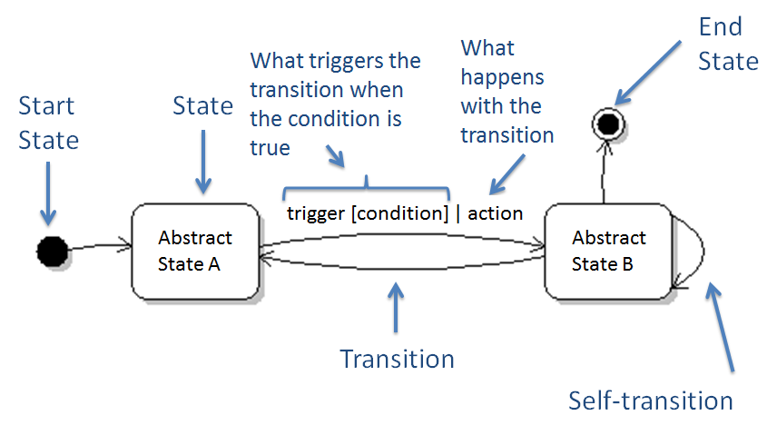
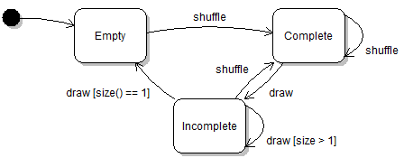
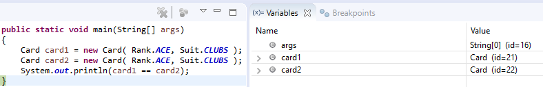
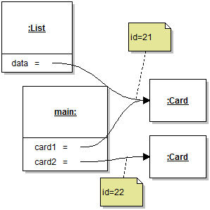
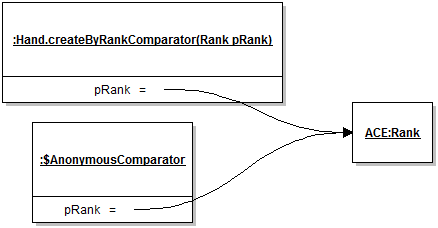

# Module 3 - Object State

## Description

The most difficult thing to reason about when looking at a program is state changes. What operations can have a side-effect, on which path can data flow, what impacts what? Is this module, I will clarify what object state is and how we can manage to keep control over its state in a principled way so we don't let the genie out of the bottle every time we instantiate an object.

## Learning Objectives

After this module you should:

* Understand the difference between a static and dynamic perspective on software;
* Understand the meaning and implications of shared state and unique objects;
* Understand the difference between the concepts of object identity and object equality, and their implications for software design;
* Be able to correctly and effectively use the methods of the `Object` class;
* Be able to effectively use the Singleton and Flyweight design patterns;
* Be able to effectively use UML State Diagrams to reason about the abstract states of complex stateful objects;
* Be able to correctly use Java's cloning mechanism;

## Notes

### General Concepts and Definitions

There are different way we can look at a software system. One way is in terms of the software elements declared in the source code and the relations between them. For example, a `Deck` class declares a field `aCards` that is a stack of `Card` instances. This is a **static view** of the system. The static view is best represented by the source code or a UML class diagram. A different, but complementary, way to look at a system, is in terms of *values* and *objects* in a running program. For example, at one point a `Deck` contains three cards, then one card is drawn, which leads to the instance of `Deck` containing two cards. This is the **dynamic (or run-time) view** of the system. The dynamic view corresponds to what we see in a debugger while stepping through the execution of a program. The dynamic view *cannot* easily be represented by any one diagram. Instead, we rely on object diagrams, *state diagrams* (introduced in this module), and *sequence diagrams* (introduced in Module 5). The static and dynamic views are two complementary perspectives in software design. Sometimes it's best to think of a problem and solution in static terms, sometimes in dynamic terms, and sometimes we really need both. This module focuses on understanding important *dynamic* properties of software.

This duality between the static and dynamic perspective on a software system is akin to the wave-particle duality for representing the phenomenon of light in physics:

> It seems as though we must use sometimes the one theory and sometimes the other, while at times we may use either. […] We have two contradictory pictures of reality; separately neither of them fully explains the phenomena of light, but together they do. - Albert Einstein and Leopold Infeld, The Evolution of Physics, pg. 262-263

So, to paraphrase for software design: It seems as though we must use sometimes the one perspective and sometimes the other, while at times we may use either. We have two *complementary* pictures of a program; separately neither of them fully explains the phenomena of software, but together they do.

An important concept when thinking of a design in terms of run-time objects is that of **object state**. Informally, state refers to the particular pieces of information the object represents at a given moment. It is generally useful to distinguish between *concrete state* and *abstract state*. The **concrete state** of an object is the collection of values stored in the object's fields. For example, if we consider a `BankAccount` object that is simply a wrapper for an `int`:

```java
public class BankAccount
{
	private int aAmount = 0;
	...
```

the cardinality of the space of possible concrete states for `BankAccount` is `2^32`, or about 4 billion states. As soon as objects have fields of reference types, the size of the state space explodes dramatically. For example, the state space of a `Deck` object includes all possible permutations of any number of cards in the deck, a number in the range of 2e68 (two times 10 to the 68th power). In the case of the `BankAccount` object, adding an `aName` field of type `String` blows up the size of the state space to something that is only limited by the physical memory of the computing system. For this reason, when designing software, it is more practical to think in terms of *abstract states*. 

In principle, an **abstract state** is an arbitrarily-defined subset of the concrete state space. For example "even balance" could be an abstract state for the `BankAccount` object that groups the roughly `2^31` states representing an even number of some currency in the account. Likewise for an instance of the `Deck` class, the abstract state "three kings" could represent any possible configuration of the deck where exactly three cards of rank `Rank.KING` are present. These two examples illustrate the fact that because abstract states are *arbitrary* partitions of the state space, they can really be defined as anything. It should however be evident that neither of these two abstract states would be particularly useful for designing a software solution to either the problem of bank management or card game playing. In practice, the software design task is to define abstract states that correspond to characteristics that will help construct a clean solution. A more useful abstract state for `BankAccount` would be "positive balance", and one for `Deck` would be "empty" (no cards in the deck), which in this case corresponds to a single concrete state.

### UML State Diagrams

**UML State Diagrams** represent a *dynamic*, or *run-time* view of a software system. They are useful to represent how objects can *transition* from one abstract state to another during their lifetime as a reaction to external events (typically, method calls). The annotated diagram below provides all the notation I will be using in the book.



The following example illustrates both the notation and purpose of UML state diagrams. It models some of the important abstract states of an instance of a class `Deck` that represents a deck of 52 playing cards. Even this simple diagram captures key information about the design of the `Deck` class.



The abstract state `Empty` is annotated as the **start state**, which allows us to infer that the constructor returns a reference to a new deck object with no cards in it. 

In UML State Diagrams, **absence of a transition** usually means that the absent transition is *invalid* for that state. Here we can see that we cannot `draw` cards from an empty deck. Note that the transitions are annotated with names that correspond to methods of the class `Deck`. The only **legal transition** out of the `Empty` state is `shuffle` which brings the object in the `Complete` state. From this it can easily be inferred that "Complete" is a shorthand for "Complete and shuffled" (in this particular design). 

The `shuffle` transition out of the `Complete` state illustrates the idea of **self transitions**, namely, events that do not result in a change of abstract state. The only legal transition out of the `Complete` state is `draw`, which inevitably brings the deck object to an `Incomplete` state. 

It is also possible to annotate transitions with an **action** that describes what happens as the result of the transition. The action that corresponds to the `draw` event is "remove card from the deck". The action information is optional and here I chose to leave it out of the diagram because it is obvious, and therefore adds no value to the diagram. 

The two transitions out of the `Incomplete` state illustrate the importance of **conditions**, because here without the concept of a condition we would not be able to model the distinction between a `draw` event that leads to the `Empty` state, and a `draw` event that keeps the object in the `Incomplete` state. In this book, the language I use for modeling conditions does not need to follow a formal specification, but I nevertheless like to specify the conditions using pseudo-code that is very close to what could be reasonably tested on an instance of the object. Here the conditions would assume the presence of an (at least private) `size` method in the `Deck` class.

Finally, this diagram does not include any **end state**. The end state model element is used to specify if an object *must* be in a certain state at the end of its lifetime (i.e., in Java, when it is garbage collected). In many designs, objects can end their life (stop being used) in any state, in which case the end state model element does not apply.

An important benefit of State Diagrams is that they allow us to self-evaluate the impact of design decisions on the complexity of the abstract state space that must be considered when working with an object. Here the state space is very simple (3 states) *because of the decision to bundle the deck initialization code together with the shuffling code*. Separating this behavior into distinct `initialize` and `shuffle` events, or including a `sort` event, leads to a much more complicated state space for the object.

Another important benefit of State Diagrams is that it supports a systematic reasoning about the behavior of an object of a given class. When modeling the state of an object, a good practice is to visit each state and consider each possible type of event. This simple procedure is an excellent way to avoid overlooking certain paths through a program (e.g., shuffling an incomplete deck).

When getting started with modeling object state with UML State Diagrams, one common tendency is to use the state diagram notation to model a type of "data-flow" information, where states represent "processing", and arrows represent the flow of data between processing stages. This is an incorrect use of the notation. A good tip for avoiding this pitfall is to think about the names of the states. If the names assigned to "states" include verbs or generally feel like they are describing actions (e.g. "draw card"), it is probably a sign that the diagram does not represent a good model of the state space.

Finally, it will be readily apparent that the concept of state diagram is very similar to that of [Deterministic finite automata (DFA)](https://en.wikipedia.org/wiki/Deterministic_finite_automaton). This is not a coincidence, as both notations are intended to model some sort of stateful phenomenon. However, the purpose of each notation is different. While the purpose of DFAs is to support the formal modeling of computation, the purpose of UML state diagrams is to support software engineering tasks such as software design, testing, and documentation.

### Object Identity, Equality, and Uniqueness

Three important concepts to keep in mind when designing with objects are those of *identity*, *equality*, and *uniqueness*.

**Identity** refers to the fact that we are referring to a particular object, even if this object is not in a named variable. In terms of programming environments, the identity of an object usually refers to its "memory location". However, in modern programming systems the memory management of objects is heavily abstracted, and for this reason it's best to simply think in terms of object identity. Most integrated development environments will supply a convenient handle to represent an object's identity. For example, in the Eclipse debugger this is represented by the object id.



In this small example two `Card` objects are created, and consequently result in two distinct objects with two distinct identities, represented with internal object identifiers 21 and 22. In the object diagram below, the `main` method and its two variables is represented as an object. The diagram shows how object identity corresponds to both object model elements and the references to these objects. If, for instance, a reference to the `Card` object with id 21 is added to a list, there will be two shared references to a single identity.



The last statement in the `main` method, in the figure above, is a reminder that in Java, the `==` returns `true` if the two operands evaluate to the same value. In the case of values of reference types, "the same value" means referring to the same object (identity). So here the statement returns false because, although both cards represent an ace of clubs, they are references to distinct objects.

The situation above, where two distinct `Card` objects represent the ace of clubs, illustrates the concept of **object equality**. In the general case, *equality* between two objects must be programmer-defined because the meaning of equality cannot always be inferred from the design of the object's class. In simple cases (like objects of class `Card`), one could say that two objects are *equal* if all their fields have the same value, but for many objects of more complex classes, this would be too strict. For example, if some objects cache values or have non-deterministic internal representations, they could be "equal" in the practical sense, without having *precisely* the same value for each field, transitively. 

For this reason, Java provides a mechanism to allow programmers to specify what it means for two objects of a class to be equal. This specification is realized by *overriding* the [equals](http://docs.oracle.com/javase/8/docs/api/java/lang/Object.html#equals-java.lang.Object-) and [hashCode](http://docs.oracle.com/javase/8/docs/api/java/lang/Object.html#hashCode--) methods. The default implementation of the `equals` method defines *equality as identity*. In other words, if the `equals` method is not redefined for a class, `a.equals(b)` is the same as `a == b`. In many situations, like our example of playing cards, this is not what we need, and we must supply our own implementation of the `equals` method. Implementations of `equals` can usually follow this example as a template:

```java
public boolean equals(Object pObject)
{
	if( pObject == null ) // As required by the specification
	{
		return false;
	}
	else if( pObject == this ) // Performance optimization
	{
		return true;
	}
	else if( pObject.getClass() != getClass()) // Ensures the objects are of the same class
	{
		return false;
	}
	else // Actual comparison code. Assumes the downcast is safe.
	{
		return aRank == ((Card)pObject).aRank && ((Card)pObject).aSuit == aSuit;
	}
}
```

We will revisit some of the details of the overriding mechanism in Module 7. For now, it suffices to say that if the `equals` method is *redefined* (or *overriden*) in a class, calling `equals` on an object of this class will result in the redefined method being executed. In our case, 

```java
card1.equals(card2)
```

will return `true`.

A very important note when overriding `equals` in Java, is that any class that overrides `equals` must also override `hashCode` so that the following constraint is respected: "If two objects are equal according to the `equals(Object)` method, then calling the `hashCode` method on each of the two objects must produce the same integer result." [[Javadocs]](http://docs.oracle.com/javase/8/docs/api/java/lang/Object.html#hashCode--). This constraint is necessary because, among other, many classes of the collections framework rely interchangeably on equality testing and on an object’s hash code for indexing objects in internal data structures. 

A final consideration related to identity and equality is the concept of **uniqueness**. In our example program, we could rightfully wonder what is the point of tolerating duplicate objects that represent exactly the same card (e.g., ace of clubs). A sometimes very useful property for the objects of a class is *uniqueness*. Objects of a class are unique if it is not possible for two distinct objects to be equal. If the objects of a class can be guaranteed to be unique, then we no longer need to define equality, because in this specific case, equality become identical to identity and we can compare objects using the `==` operator. Although strict guarantees of uniqueness are almost impossible to achieve in Java due to mechanisms such as reflection and serialization, in practice the use of two design patterns and the conscious avoidance of these mechanisms provides a "pretty good" guarantee that can help greatly simplify some designs.

### Sharing References with Anonymous Classes and Lambda Expressions

[Module 1](Module-01.md) introduced the concept of *encapsulation*, and this module focused on the careful management of objects and their state. One common programming language featurel, *anonymous classes and functions* requires careful consideration to ensure references to objects are not shared by accident.

As demonstrated in the code of [Hand.createByRankComparator](answers/Hand.java), methods of Java anonymous classes have access to an interesting scope that seems to include the local variables of the parent method.

```java
public static Comparator<Hand> createByRankComparator(Rank pRank)
{
   return new Comparator<Hand>()
   {
      @Override
      public int compare(Hand pHand1, Hand pHand2)
      {
         return countCards(pHand1, pRank) - countCards(pHand2, pRank);
      }
      ...
   };
}
```

Upon closer inspection, it appears that the code of method `compare` *declared inside the anonymous class* has access to the parameter `pRank` of `createByRankComparator`, which is a *separate method in a separate class*. What could pRank possibly refer to when the program is running? Once the `createByRankComparator` method returns an object, this object has its own life-cycle that is completely independent from that of the `Hand` object. Yet this is legal, compilable code, that actually works.

Because referring to variables in the parent methods from an anonymous class is such a useful programming idiom, it is fully supported by the compiler. To make this work, when the compiler creates the definition of the anonymous class, it also (invisibly) adds *fields* to the anonymous class, and copies references to each of the local variable referenced in the code of the anonymous class's method into a field. Thus, once an object of the anonymous class is created, the references to the local variables are now stored in fields of the same name in the anonymous class. The object diagram below illustrates this idea:



In this diagram the factory method is represented as a separate object with field `pRank` used to represent its parameter. This method returns a completely new object of an anonymous class. So that the `compare` method can still refer to the `pRank` parameter, a field `pRank` is created in the instance of the anonymous comparator, and the value of `pRank` is copied to it. A method definition together with references to its local environment variables is commonly called a [closure](https://en.wikipedia.org/wiki/Closure_(computer_programming)). As the object diagram shows, it should be clear that closures can easily lead to shared references between object instances. To prevent unexpected behavior, Java prevents reassigning local variables that are referenced in anonymous classes. In Java 7 and earlier, local variables referenced in anonymous classes had to be declared `final`. With Java 8 the compiler can infer variables to be *effectively final* without the keyword. In any case, the point of this appendix is to emphasize that sharing references to objects through closures is still sharing references to objects, and when the shared objects are mutable, one should keep in mind that it can weaken encapsulation.

### The Flyweight Design Pattern

The [Flyweight Pattern](https://en.wikipedia.org/wiki/Flyweight_pattern) is provides a useful way to cleanly manage collections of low-level immutable objects. Although often use to address *performance concerns*, the Flyweight is also valuable to ensure the uniqueness of objects of a class.

**Context:** Instances of a class are heavily shared and compared throughout the software system.

**Solution:** 

The general idea is to manage the creation of objects of a certain class, call the `Flyweight` class, through a factory method. The three main components of the Flyweight pattern are:

1. A private constructor for the Flyweight, so clients cannot control the creation of objects;
2. A data structure that keeps a list of Flyweight instances, stored in a static field;
3. A static factory method that returns the unique Flyweight object that corresponds to the input parameter.

**Example:** 

See Solitaire v0.3: [Card](https://github.com/prmr/Solitaire/blob/v0.3/src/ca/mcgill/cs/stg/solitaire/cards/Card.java).

**Discussion:**

An important concern when implementing the Flyweight pattern is whether to pre-initialize the flyweight objects, or whether to do this lazily, by creating objects as they are requested through the factory method. The answer is problem-dependent. In general, in cases where there exists a small and finite set of flyweights, it may make sense to pre-initialize them (as in the example). In other cases, additional logic must be added to the factory method to check if the object exists in the collection. It is also important to note that Flyweight objects should be *immutable* to ensure that they can be shared and compared throughout the program.

### The Singleton Design Pattern

The Singleton design pattern provides a principled way to ensure that there is *only one instance of a given class* as any point in the execution of a program. This design pattern is useful to simplify the access to stateful objects that typically assume the role of a controller of some sort.

**Solution:** 

1. A private constructor for the Singleton, so clients cannot create duplicate objects;
2. A static final field keeping a reference to the single instance of the singleton object.
3. A static accessor method, usually called `instance()`, that returns the unique instance of the Singleton.

**Discussion:**

The Singleton pattern differs from the Flyweight in that it attempts to guarantee that there is *a single instance of a class*, as opposed to *unique instances of a class*. Singleton objects are typically stateful, wheras Flyweights should be immutable. 

A typical mistake when implementing the Singleton pattern is to store a reference to an instance of the class in a static field called `INSTANCE` or something like it, without taking proper care to prevent client code from independently creating new objects. For example, class `ClosedInputStream` of the Apache Commons IO library defines a ["singleton" field](https://github.com/apache/commons-io/blob/ffcbfdc80ed7ca7ffce883f615f710beabd9e06c/src/main/java/org/apache/commons/io/input/ClosedInputStream.java#L36), but the class is not really a singleton because it is re-instantiated in different parts of the library, for example [here](https://github.com/apache/commons-io/blob/ffcbfdc80ed7ca7ffce883f615f710beabd9e06c/src/main/java/org/apache/commons/io/input/CloseShieldInputStream.java#L49) and [here](https://github.com/apache/commons-io/blob/ffcbfdc80ed7ca7ffce883f615f710beabd9e06c/src/main/java/org/apache/commons/io/input/AutoCloseInputStream.java#L65). In this case, use of the Singleton name is harmfully misleading, because users of the library may rely on the fact that the class supports a single instance when it does not.

### A Review of Object Characteristics

| Characteristic | Description |
| --- |---|
|**Immutability:** | An object is immutable if it is not possible to change its state.|
|**Equality:** | Two objects are equal if they have the same value from the point of view of the user of the object. Equality is a programmer-defined characteristic that cannot be automatically determined by the program. |
|**Identity:** | The system-level definition of an object. Two variables storing a reference to the same object identity refer to the same object. |
|**Sharing:** | A reference to an object is shared if it can be referred to from different places (e.g., scopes) in a program. |
|**Uniqueness:** | Objects can be said to be unique if it is not possible to have two objects that are equal. |

## Reading

* Solitaire v0.3: [Card](https://github.com/prmr/Solitaire/blob/v0.3/src/ca/mcgill/cs/stg/solitaire/cards/Card.java) as an example of the Flyweight pattern in action.
* Solitaire v0.3: [CardImages](https://github.com/prmr/Solitaire/blob/v0.3/src/ca/mcgill/cs/stg/solitaire/cards/CardImages.java) as a different example of the Flyweight pattern in action.

## Exercises

Exercises prefixed with **(+)** are optional, more challenging questions aimed to provide you with additional design and programming experience. Exercises prefixed with **(P)** (for "project") will incrementally guide you towards the ultimate completion of a complete Solitaire application.

For maximum learning effectiveness, I recommend peeking at the [answers](answers/Answers-03.md) only after giving the problems an honest try.

1. Create a UML State Diagram that models the abstract states of a hypothetical `Dryer` object that behaves as follows. *The dryer is normally off. To get it to operate you have to put in 2.00$. Once the money is inserted, you cannot add additional credit until the drying is over. The mechanism to insert the money only allows you to put the exact amount in one go. To start the machine once the money is inserted, you have to close the door and press the start button. The dryer will then operate for exactly 60 minutes, and then stop by itself. If you open the door while it’s in operation, the dryer will stop and whatever time was left is lost.*

2. Create a UML State Diagram that models the abstract states of a hypothetical `VendingMachine` object that behaves as follows. *The machine sells a selection of different drinks. All drinks have a price, not necessarily the same. If a user selects a drink, the price is displayed. If the user adds enough coins within 60 seconds, the drink is provided and change is returned. If a user adds coins without selecting a drink, the available balance is shown. If a user selects a drink that is worth less than the balance, the drink is provided and changed is returned. If not, an error message shows "insufficient balance". A reset button resets any selection and returns the balance.*

3. Change the design of your `Card` class to ensure the uniqueness of its instances through the use of the Flyweight Design Pattern.

0. (P) Design and implement a class `WorkingStack` that manages the state of one of the working stacks in Solitaire. Note that as opposed to the `SuitStack` designed in Module 2, for `WorkingStack` you have to solve the problem of remembering which card is visible (or face up), and which card is not.

0. Using the Singleton Design Pattern, design an `GameModel` class that is a singleton.

0. (P) Complete the design of the `GameModel` class. This class will be responsible for managing all the necessary state for a game of solitaire. The class should offer the following state-changing services (through methods): `reset()` initializes a new game by clearing all the working stacks, shuffling the deck, and placing cards on the working stack according to the rules of solitaire (one card on the first stack, two on the second, etc., with the top card of each stack visible); `move(Card, Location)` Moves a card from an assumed legal playing position to the specified location (to be designed); `discard` Moves a card from the top of the deck to the top of the discard pile. In addition, the `GameModel` should provide all the necessary state-querying services, including methods to check the state of the deck and the discard pile (empty or nor), view the cards in the different stacks, etc. In particular, the `GameModel` class should provide a method `getScore()` that returns the cumulative number of cards in the four suit stacks. A score of 52 indicates a win.

0. (P) Create a UML Class diagram that illustrates the most important elements of your implementation of the `GameModel` class; 

0. (P) Create a UML State diagram that captures all the main abstract states of an instance of the `GameModel` class, and the transitions between them; 

0. (P) Using the Strategy Design Pattern, add an `autoplay()` method to the `GameModel`, whose purpose is to automatically perform a legal move, if possible. Carefully consider how the strategy should work (inputs, outputs). Consider using the interface segregation principle to decouple the strategy from the `GameEngine`.

0. (P+) Implement, in a main method somewhere (where?), a small driver program that automatically plays N games and reports the average final score per game and the percentage of games won. If, for N=10,000, you get above 2% win or 9 points per game on average, make sure to let the instructor know.

---

<a rel="license" href="http://creativecommons.org/licenses/by-nc-nd/4.0/"></a>

Unless otherwise noted, the content of this repository is licensed under a <a rel="license" href="http://creativecommons.org/licenses/by-nc-nd/4.0/">Creative Commons Attribution-NonCommercial-NoDerivatives 4.0 International License</a>. 

Copyright Martin P. Robillard 2017
