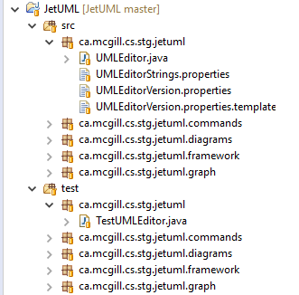
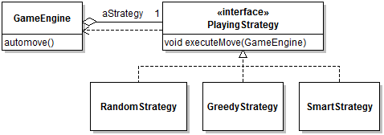

# Module 4 - Unit Testing

## Description

How can we have confidence that our code is working properly? Every time we write or change a line of code, we could be introducing a lethal bug. *Unit testing* is a practice wherein we automatically execute our code to check that it does what we think it should. With unit testing, we can build a possibly large collection of tests that can quickly be run, for instance every time we change the code, to make sure we didn't break anything that used to work. In this module, I will introduce mechanisms that facilitate unit testing (reflection and type annotations) and provide you with basic techniques for designing unit tests and evaluating their quality.

## Learning Objectives

After this module you should:

* Be able to explain the foundational concepts of testing using the proper terminology;
* Understand type annotations and program reflection and be able to use them effectively;
* Be able to write unit tests with JUnit;
* Be able to approach more advanced testing problems requiring reflection or mock objects;
* Be able to understand the output of a test coverage tool such as EclEmma;
* Be able to understand basic test suite adequacy criteria and the relations between them;

## Notes

### General Concepts and Definitions

Software quality problems are often caused by programmers writing code that doesn't quite do what they expect. For example, this [bug](https://github.com/prmr/JetUML/issues/188) in JetUML made it impossible to see the directory structure in a file chooser object because of an incorrect *compound* (i.e., multi-part) condition.

One way to detect bugs, and to gain confidence that a part of a program does what we expect, is to *test* it. [Testing](https://en.wikipedia.org/wiki/Software_testing) in the general sense is a software quality assurance technique that can take many forms. In the context of an introduction to software design, I will be using a specific testing approach called [Unit testing](https://en.wikipedia.org/wiki/Unit_testing). The idea of unit testing is to test a very small part of the program in isolation. This way, if the test fails, it is easy to know where to look for problems.

In practice, a **unit test** consists in one execution of a **unit under test (UUT)** with some **input data** and the comparison of the result of the execution against some **oracle**. For example, the statement:

```java
Math.abs(5) == 5;
```

technically qualifies as a test. Here the UUT is the library method `Math.abs(int)`, the input data is the integer 5, and the oracle is, in this case, also the value 5. When testing non-static method, it's important to remember that the input data includes the receiver object (the object that receives the method call).

Although it is possible to test a system manually, in practice unit testing is done automatically. Since in software development the way to automate anything is to write a program to do it, to automate software testing we also write code to test other code. 

This task is typically supported by a **unit testing framework** like [xUnit](https://en.wikipedia.org/wiki/XUnit), which in the case of Java means [JUnit](https://en.wikipedia.org/wiki/JUnit). JUnit automates a lot of the mundane parts of unit testing, including collecting tests, running them, and reporting the results.

### Basics of JUnit

In JUnit a unit test maps to a method. The code below illustrates a very simple unit test with JUnit.

```java
public class AbsTest
{
   @Test
   public void testAbsPositive()
   {
      assertEquals(5,Math.abs(5));
   }
	
   @Test
   public void testAbsNegative()
   {
      assertEquals(5,Math.abs(-5));
   }
	
   @Test
   public void testAbsMax()
   {
      assertEquals(Integer.MAX_VALUE,Math.abs(Integer.MIN_VALUE));
   }
}
```

The `@Test` [Annotation](https://docs.oracle.com/javase/tutorial/java/annotations/index.html) indicates that the method should be run as a unit test. This annotation is defined in the JUnit library, which must be added to a project's classpath before it is visible. The test method should typically contain at least one call to a UUT. The way to automatically verify that the execution of a UUT has the expected effect is to execute various calls to `assert*` methods. Assert methods are different from the `assert` statement in Java. They are declared as static methods of the class `org.junit.Assert*` and all they do is basically verify a predicate and, if the predicate is not true, report a *test failure*. The JUnit framework includes a GUI component called a *test runner*. To execute the JUnit test running from within Eclipse, right-click on a project that contains at least one JUnit test method, and select `Run As | JUnit Test`. When executing, all the JUnit test runner does is inspect the program, collect all methods flagged as unit tests using annotations, invoke them, then report whether the tests passed or failed.

For additional instructions on how to use JUnit, read [this tutorial](http://www.vogella.com/tutorials/JUnit/article.html). To fully understand how JUnit works it is necessary to first read the [Annotations](https://docs.oracle.com/javase/tutorial/java/annotations/index.html) and [Reflection](https://docs.oracle.com/javase/tutorial/reflect/) tutorials.

### Test Suite Organization

A collection of tests for a project is known as a **test suite**. A common question is how to organize our tests in a sensible manner. There are different approaches, but in Java a common way to organize tests is to have one *test class* per *project class*, where the test class collects all the tests that test methods of that class. Furthermore, it is common practice to locate all the testing code in a different *source folder* with a package structure that *mirrors the project's package structure*. The rationale for this idiom is that in Java classes in the same package are in the same *package scope* independently of their location in a file system. This means that classes and methods in the test package can refer to non-public (but non-private) members of classes the project code. This strategy simplifies the test code. The figure below illustrates this idea.



### Test Fixtures

In test classes that group multiple test methods, it will often be convenient to define a number of "default" objects or values to be used as receiver objects and/or oracles. This practice will avoid the duplication of setup code in each test method. Baseline objects used for testing are often referred to as a *test fixture*, and declared as fields of a test class. However, when designing a test suite with JUnit, is it extremely important to know that JUnit *provides no ordering guarantee of any kind* for the execution of unit tests. In consequence, unit tests must be independent of each other so that they can be executed in any order. This further implies that no test method should rely on the fixture being left in a given state by another test. In most cases this precludes the use of the class constructor to initialize the fixture, because the constructor is only called once. The workaround is to nominate a method of the test class to execute before any test method. In JUnit this method is nominated using te `@Before` annotation. Fixture initialization code should therefore be located in this method. The use of test fixtures in JUnit is illustrated by most test classes in both sample projects. For example, in the Solitaire application's [TestSuitStackManager](https://github.com/prmr/Solitaire/blob/master/test/ca/mcgill/cs/stg/solitaire/model/TestSuitStackManager.java) class, the fixture consists of a single field `aSuitStackManager` which is initialized with a fresh object in method `setup`:

```java
@Before
public void setup()
{
   aSuitStackManager = new SuitStackManager();
}
```

which is executed before the execution of every `@Test`-annotated method.

### Tests and Exceptional Conditions

An important point when writing unit tests is that what we are testing is *that the UUT does what it's supposed to*. This means that when using design by contract, it does not make sense to test code with input that does not respect the UUT's preconditions, because the resulting behavior is *unspecified*. For example, for method [peek](https://github.com/prmr/Solitaire/blob/master/src/ca/mcgill/cs/stg/solitaire/model/SuitStackManager.java#L104), which has as precondition `assert !aStacks.get(pIndex).isEmpty();`, it would be awkward to try to write a test for an empty stack. What would be the oracle?

The situation is very different, however, when exceptional behavior *is explicitly part of the interface*. For instance, for method [peek](https://docs.oracle.com/javase/8/docs/api/java/util/Stack.html#peek--) of the Java `Stack` class, peeking an empty stack *should* result in an `EmptyStackException`. If it does not, then the `peek` method does not do what is expected, and this means it is faulty.

This situation raises the question of how to test for exceptional conditions. In JUnit there are two idioms. One is to use the `expected` property of the `@Test` annotation:

```java
@Test(expected = EmptyStackException.class)
public void testPeekEmpty1()
{
   Stack<String> stack = new Stack<>();
   stack.peek();
}
``` 

With this feature, JUnit will automatically *fail the test* if the execution of the corresponding test method completes *without* raising an exception of the specified type. This testing idiom is very useful, but limited in the sense that the exceptional behavior must be the last thing to happen in the test. In cases where it is desirable to execute additional testing code after testing the exceptional behavior, the following idiom can be used:

```java
@Test
public void testPeekEmpty2()
{
   Stack<String> stack = new Stack<>();
   try
   {
      stack.peek();
      fail();
   }
   catch(EmptyStackException e )
   {}
}
```

This idiom is a bit convoluted, but does exactly what we want. If the UUT (the `peek` method here) is faulty in the sense that it does not raise an exception when it should, the program will keep executing normally and reach the following statement, which will force a test failure. If the UUT is (at least partially) correct in that it does raise the exception when it should, control-flow will immediately jump to the catch clause, thereby skipping the `fail();` statement. It is then possible to add additional code below the catch clause.

### Encapsulation and Unit Testing

A common question when writing tests is, how can we test private methods? There are different possible avenues for answering that question, but experts disagree about which one is the right one:

* Private methods are internal elements of other, accessible methods, and therefore are not really "units" that should be tested. Following this logic, the code in private methods should be tested indirectly through the execution of the accessible methods that call them;
* The `private` access modifier is a tool to help us structure the project code, and tests can ignore it.

Although I understand the rationale of the first approach, I personally fall in the second camp. There are many cases where a neat little method can be restricted to a class's scope, but it would still be valuable to test it in isolation. This situation is exemplified by the tests added to test [this fix](https://github.com/prmr/JetUML/issues/188).

To by-pass the `private` access modifier, it is necessary to use [metaprogramming](https://docs.oracle.com/javase/tutorial/reflect/).

The following code sample illustrates the main steps:

```java
public class TestEditorFrame 
{ 
   private Method aCreateFileFilter;
   private EditorFrame aEditorFrame; 
	
   @Before
   public void setup() throws Exception
   {
      aCreateFileFilter = EditorFrame.class.getDeclaredMethod("createFileFilter", String.class);
      aCreateFileFilter.setAccessible(true);
      aEditorFrame = new EditorFrame(UMLEditor.class);
   }
```

This test class definition includes, as part of its fixture, a field that stores a reference to an instance of class `Method` that represents the private method we want to test. The field is initialized in the `setup` method, and made accessible outside the class scope using the `setAccessible` method. This last part is what bypasses the `private` keyword.

In the test class, we can then define a *convenience method* that launches the execution of the UUT (`createFileFilter`):

```java
private FileFilter createFileFilter(String pFormat)
{
   try
   {
      return (FileFilter) aCreateFileFilter.invoke(aEditorFrame, pFormat);
   }
   catch(InvocationTargetException | IllegalAccessException pException)
   {
      TestCase.fail();
      return null;
   }
}
```

In the methods of the test class, calling `createFileFilter` now has the same effect as calling `createFileFilter` on an instance of `EditorFrame`. This way the rest of the test looks pretty normal:

```java
@Test
public void testCreateFileFilteAcceptDirectory()
{
   FileFilter filter = createFileFilter("PNG");
   File temp = new File("foo");
   temp.mkdir();
   assertTrue(temp.isDirectory());
   assertTrue(filter.accept(temp));
   temp.delete();
}
```

except that it does not directly call the UUT, but a wrapper that uses metaprogramming to call the UUT while by-passing the access restriction of the `private` keyword.

### Testing with Stubs

The key to unit testing is to test small parts of the program *in isolation*. But what happens if the part we want to test triggers the execution of a large chunk of the program? This situation is illustrated in the following design, which is a simplified version of the Solitaire sample application. The `GameEngine` has an `automove()` method that triggers the computation of the next move by dynamically delegating the task to a strategy, which could be any of the three options. Here we would like to write a unit test for the `GameEngine.automove()` method.



In this task we face at least three problems:

* Calling the `void executeMove(...)` method on any strategy will trigger the execution of presumably complex behavior by the strategy, which possibly depends on many other parts of the code. This does not align well with the concept of unit testing, where we want to test small pieces of code in isolation.
* How can we know which strategy would be used by the game engine? Presumably we need to determine an oracle for the results.
* How is this different from testing the strategies individually?

The way out of this conundrum is the realization that the responsibility of `GameEngine.automove()` is *not* to compute the next move, but rather *to delegate this to a strategy*. So, to write a unit test that tests that the UUT does what it is expected, we *only need to verify that it relays the automove computation to a strategy*. This can be achieved with the writing of a *stub* (a.k.a. [mock object](https://en.wikipedia.org/wiki/Mock_object), although there's no agreement on terminology).

An object stub is a greatly simplified version of an object that mimics its behavior sufficiently to support the testing of a UUT that uses this object. Using stubs is heavily dependent on types and polymorphism (see Module 2). Continuing with our `automove` situation, here we simply want to test that the method calls a strategy, so we will define a dummy strategy in the test method:

```java
public class TestGameEngine
{
   @Test
   public void testAutoPlay() throws Exception
   {
      class StubStrategy implements PlayingStrategy
      {
         private boolean aExecuted = false;
			
         public boolean hasExecuted() { return aExecuted; }
			
         @Override
         public void executeMove(GameEngine pGameEngine)
         {
            aExecuted = true;				
         }
      }
```

This strategy does nothing except remember that its `executeMove` method has been called. We can then use an instance of this stub instead of a "real" strategy in the rest of the test. To inject the stub in the game engine, we again rely on metaprogramming:

```java
@Test
public void testAutoPlay() throws Exception
{
	...
   Field strategyField = GameEngine.class.getDeclaredField("aStrategy");
   strategyField.setAccessible(true);
   StubStrategy strategy = new StubStrategy();
   GameEngine engine = GameEngine.instance();
   strategyField.set(engine, strategy);
```

at which point completing the test is simply a matter of calling the UUT (`automove`) and verifying that it did properly call the strategy:

```java
engine.autoMove();
assertTrue(strategy.hasExecuted());
```

The use of mock objects in unit testing can get extremely sophisticated, and frameworks exist to support this task (e.g., [jMock](http://www.jmock.org/)). In this textbook, we only cover the use of stubs/mocks for simple situations like the one illustrated here. Note that the situation illustrated here is boiled down to its essence for pedagogical purposes. In a realistic development scenario it would probably be judged overkill to use a stub to test a single method call.

### Selecting Test Inputs

Up to now this module covered how to define an and implement unit tests from a practical standpoint, but avoided the question of *what to test*, or what inputs to provide to the UUT. It should be clear that for the vast majority of UUTs it is not physically possible to *exhaustively test* the input space. Consider this function which should return the roots of a quadratic formula:

```java
/**
 * Finds the roots for ax^2 + bx + c
 */
public static double[] roots(double a, double b, double c)
```

The input space for this function is enormous. The much smaller input space induced by the same parameters of type `int` still comprises `2^(32+32+32)` distinct values. Assuming you can run one billion tests per second, testing all possible inputs on this simplified function would take (about) 182 times the age of the universe. Clearly we need to select some input, a problem known as **test case selection**, where a **test case** can be considered to be an set of input for an assumed UUT. For example, `(0,0,0)` is a test case for the `roots` function. The basic challenge of the test case selection problem is to test *effectively*, meaning to find a minimal set of test cases that provides us a maximal amount of "testing" for our function. Unfortunately, while it is obvious what a minimal number of test cases is, there is no natural or even agreed-upon definition of what an "amount of testing" is. 

There are two basic ways to approach the selection of test cases:

* **Functional (or black-box) testing** tries to cover as much of the *specified* behavior of a UUT as possible, based on some external specification of what the UUT should do. For the `roots` function, this would mean, for example, ensuring we find inputs for formulas that have zero, one, two roots, some combination of positive and negative roots, etc. There are many advantages to black-box testing, including that you don't need access to the code of the UUT, testing can reveal problems with the specification, and that the tests can reveal missing logic. 

* **Structural (or white-box) testing** tries to cover as much of the *implemented* behavior of the UUT as possible, based on an analysis of the source code of the UUT. An example for the `roots` function is provided below. The main advantage of white-box testing is that it can reveal problems caused by low-level implementation details that are invisible at the level of the specification.

Coverage of functional testing techniques is outside of the scope of this book, so the reminder of this module provides a brief introduction to structural testing.

Consider the full implementation of the `roots` function:

```java
1  public static double[] roots(double a, double b, double c)
2  { 
3     double q = b*b - 4*a*c;
4     if( q > 0 && a != 0 ) // Two roots
5     {   
6        return new double[]{(-b+q)/2*a, (-b-q)/2*a};
7     }
8     else if( q == 0 ) // One root
9     {
10      return new double[]{-b/2*a};
11    }
12    else // No root
13    {
14       return new double[0];
15    }
16  }
```

Here we can intuitively see that the code structure has three "natural" pieces that correspond to the three branches of the `if-else` statement. According to the principles of structural testing we would want to find test cases that at least execute these three pieces. For example: `(3,4,1),(0,0,1),(3,2,1)`.

To support formal reasoning about code structure, we rely on the concept of a **control-flow graph (CFG)**. A CFG is a model of a UUT that represents all possible paths of execution through the CFG. Nodes in the graph correspond to either **basic blocks** or **branching statements**. Basic blocks are sequences of statements with a single entry and exit point (they are always executed together). Edges in the graph represent possible **control flow**, that is, the possibility that the program execution proceeds from one node to another. The figure below shows the CFG for the roots function. In this diagram circles represent start and end nodes, boxes represent basic blocks, and diamonds represent branching statements, with the control flow for both true (solid) and false (dashed) conditions.


### Test Adequacy Criteria

We can now return to the problem of selecting test cases so that our test suite is "good enough". In structural testing, to know whether a test suite is "good enough" we rely on **test suite adequacy criteria** defined using the CFG. A *test suite adequacy criterion* is a predicate that is true or false for a pair (program, test suite). For example, a development team could decide that for a test suite to be good enough for their program, "80% of all statements should be executed when the test suite is executed".

**Statement coverage** is the simplest criterion. It is defined as `(number of statements executed)/(number of statements in the program)`. In the example above, the test case `(3,4,1)` achieves `3/6 = 50%` statement coverage (here the start and end nodes are ignored). The rational for achieving statement coverage is simply that if a defect is present in a statement, it can't be detected if the statement is not executed. Full statement coverage corresponds to going through all the nodes in a CFG during the execution of a test suite. Note that line coverage and basic block coverage are alternatives that are practically equivalent to statement coverage.

**Branch coverage** is defined as `(number of branches executed)/(number of branches in the program)`. In the example above, the test case `(3,4,1)` achieves `1/4 = 25%` branch coverage. Full branch coverage corresponds to going through all the edges in a CFG during the execution of a test suite. 

**Path coverage** is defined as `(number of paths executed)/(number of paths in the program)`. Path coverage corresponds to going through all the possible paths in a CFG during the execution of a test suite. In the example above, the test case `(3,4,1)` achieves `1/3 = 33%` path coverage. Path coverage is considered a *theoretical* criterion because although it can be a useful concept to reason about testing in general, it cannot be achieved in practice, in particular for code that contains loops.

Because many defects can lurk in conditional statements, a number of coverage criteria target condition coverage specifically. In the case of condition-related coverage, is is more common to refer to coverage in binary terms (full coverage is achieved vs. not), as opposed to a fraction of the possible coverage.

**Basic conditions coverage** is defined as "each basic condition must have a True and a False outcome at least once during the execution of the test suite". In the example above, the test case `(3,4,1)` does not achieve basic condition coverage because of the six possible condition-outcome pairs, only `true(q > 0)` on line 4 and `true(a!=0)` on line 4 are covered.

**Branch and conditions coverage** is defined as satisfying both the branch and basic conditions criteria. In the example above, the test case `(3,4,1)` does not achieve branch and condition coverage because it achieves neither the branch nor the basic condition criteria.

**Compound conditions** is defined as achieving each possible evaluation of compound conditions. In the general case the compound conditions criterion is also considered theoretical because of the the large number of resulting combinations.

Some of the coverage criteria have a **subsumption relation** between them. For criterion A to *subsume* criterion B means that if A is achieved, B is implicitly achieved. The following subsumption relations exist between the criteria seen in this module (the relation is [transitive](https://en.wikipedia.org/wiki/Transitive_relation)):

* Branch subsumes Statement
* Path subsumes Branch
* Branch and conditions subsumes both branch and basic conditions (by definition)
* Compound conditions subsumes branch and conditions

### Practical Coverage Analysis

Test coverage is typically computed by tools that *instrument* the source or bytecode and report how much coverage is achieved for different criteria supported by the tool. For example, EclEmma supports instruction, line (a proxy for statement), and branch coverage. See the Module 0 exercises for instructions on how to install and run EclEmma.

### Acknowledgements

The part of this module on test case selection and structural testing was adapted from a lecture originally created by Prof. Andreas Zeller based on material from the book "Software Testing and Analysis: Process, Principles, and Techniques", by Pezze & Young, Wiley, 2008

## Reading

* The [Java Tutorial - Annotations](https://docs.oracle.com/javase/tutorial/java/annotations/index.html)
* The [Java Tutorial - Reflection](https://docs.oracle.com/javase/tutorial/reflect/)
* The [Vogella Unit Testing Tutorial](http://www.vogella.com/tutorials/JUnit/article.html)
* Solitaire v0.3 [TestGameModel](https://github.com/prmr/Solitaire/blob/v0.3/test/ca/mcgill/cs/stg/solitaire/model/TestGameModel.java) as a sample unit test demonstrating the use of reflection and simple mock objects.

## Exercises

Exercises prefixed with **(+)** are optional, more challenging questions aimed to provide you with additional design and programming experience. Exercises prefixed with **(P)** (for "project") will incrementally guide you towards the ultimate completion of a complete Solitaire application.

The best way to practice unit testing is, unsurprisingly, to write tests for as much code as possible. The exercises below provide some suggestions, but for additional practice you can write tests for practically any available code.

For maximum learning effectiveness, I recommend peeking at the [answers](answers/Answers-04.md) only after giving the problems an honest try.

1. Write unit tests for the Java `Math.abs()` and `Math.min(...)`.

2. Write unit tests for the Java `Stack` methods `pop`, `push`, and `peek`.

3. Create CFGs for all the methods of class [RecentFilesQueue](https://github.com/prmr/JetUML/blob/v1.0/src/ca/mcgill/cs/stg/jetuml/framework/RecentFilesQueue.java), except for `serialize` and `deserialize`. With the help of EclEmma, write tests that achieve branch coverage. Manually compute the coverage for all three condition criteria.

4. :star: Extend the previous exercise to include the `serialize` and `deserialize` methods.

5. :spades: Write unit tests for all the classes of the Solitaire application you have developed so far. Compute the coverage of your test suite with EclEmma.

6. :star: Run EclEmma on JetUML and identify some untested code. Write a new unit test and submit it as a pull request. 

---

<a rel="license" href="http://creativecommons.org/licenses/by-nc-nd/4.0/"></a>

Unless otherwise noted, the content of this repository is licensed under a <a rel="license" href="http://creativecommons.org/licenses/by-nc-nd/4.0/">Creative Commons Attribution-NonCommercial-NoDerivatives 4.0 International License</a>. 

Copyright Martin P. Robillard 2017
