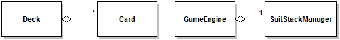
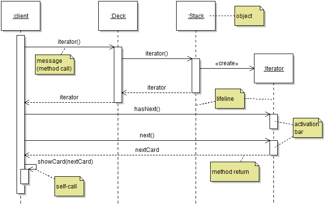
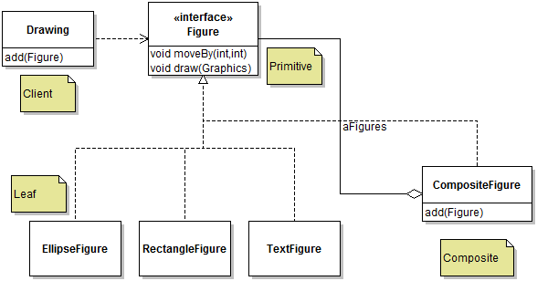
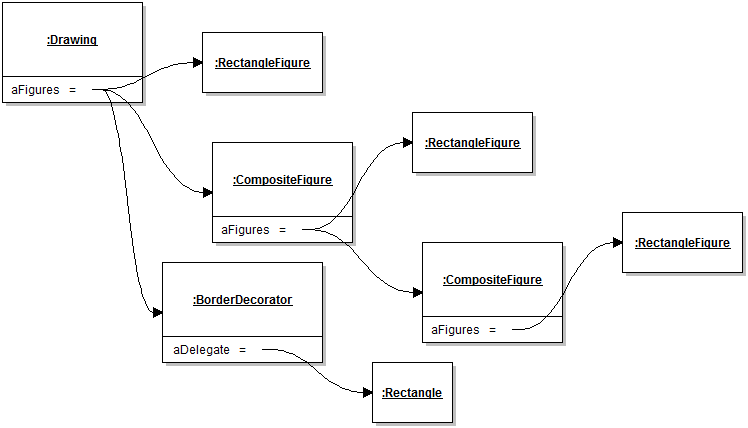
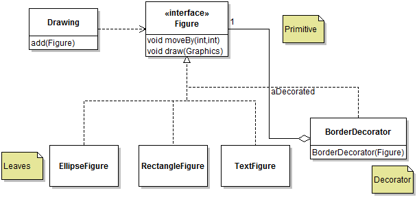
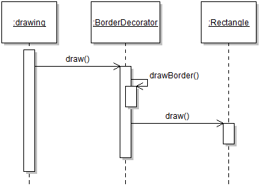
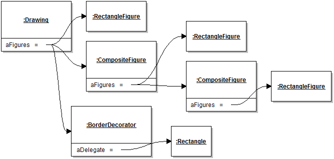
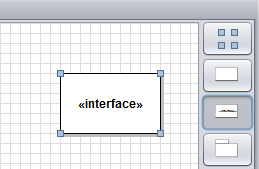
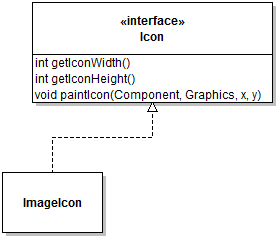

# Module 5 - Composition

## Description

Large programs are typically assembled from smaller parts. In object-oriented programming this is done through two main mechanism: *composition* and *inheritance*. Composition simply means that one object holds a reference to another object and delegates some tasks to it. Although this sounds simple enough, unprincipled composition can lead to a terrible mess of spaghetti code. In this module I will give a quick refresher on the mechanism of polymorphism and how it can be used to elegantly compose objects together by following some well-known design patterns. Note that the second way of assembling systems is through inheritance, which is more complex and will be covered in Module 7.

## Learning Objectives

After this module you should:

* Be able to explain the concept of object composition and its impact on object identity;
* Be able to use the Composite design pattern effectively;
* Be able to use the Decorator design pattern effectively;
* Be able to use the Command design pattern effectively;
* Be able to use the Prototype design pattern effectively;
* Understand the concept of polymorphic copying and be able to correctly use the Java cloning mechanism;
* To understand the Law of Demeter and be able to apply it;
* Generally solve design problems that involve manipulating object graphs;

## Notes

### General Concepts and Definitions

A general strategy for managing complexity in software design is to define larger abstractions in terms of smaller, ideally simpler ones. In practice one way to do this is **object composition**. Composing objects simply means that one object stores a reference to one or more other objects. Conceptually we could say composition can help achieve two purposes. On purpose is for one object to conceptually **aggregate** other objects and provides operations that are a function of these aggregated objects. An example is an instance of a class `Deck` that aggregates instances of class `Card`. In this case the methods of `Deck` basically are functions that operate on instances of `Card`, for example by shuffling them. Another way to understand composition is the idea of **delegation**, in that the container object *delegates* some services to the objects it contains. For example, in the Solitaire demonstration system, the `GameEngine` singleton object holds a reference to an instance of a `SuitStackManager` and *delegates* all the management of the state and computation of "suit stacks" to that object. The two purposes for composition are not mutually exclusive.

In a UML Class Diagram object composition is represented with an edge annotated with a diamond *on the side of the class whose instances hold the reference to the instances of the other class*. Note that the UML notation technically allows the distinction between two types of composition: "aggregation" (white diamond) and "composition" (black diamond). I don't work with this distinction in the course, and exclusively use the "white diamond" annotation for all types of aggregation/compositions.



Although it is technically possible to combine objects in arbitrary ways simply by defining class fields and passing object references around, unprincipled use of object composition quickly degenerates into overly-complex code. In this module I cover different ways to keep a certain amount of organization in the use of composition. 

### UML Sequence Diagrams

This module will discuss different ways to have groups of objects interact. The best way to model sequences of object interactions is through [UML Sequence Diagrams](http://www.ibm.com/developerworks/rational/library/3101.html). Just like object diagrams and state diagrams, Sequence diagrams model the *dynamic* perspective on a software system. Like object diagrams and as opposed to state diagrams, Sequence Diagrams represent *a specific snapshot* in the execution of a program. They are the closest correspondence to what one would see in the debugger's execution stack as the code is executing.

I describe the notation of Sequence Diagram through an example. The scenario modeled is the use of an iterator in the Iterator design pattern seen in [Module 2](Module-02.md). The names of model elements are provided as notes on the diagram. 



Each rectangle at the top of the diagram represents an **object**. Consistently with other UML diagrams representing system rum-time, the objects names are underlined and follow the convention `name:type` as necessary. Note how I did not give a type to the client because it does not matter, and did not give a name to the `Deck` instance because it does not matter.

The dashed vertical line emanating from an object represents the object's **lifeline**. In systems terms it represents the time (running top-down) when the object exists, i.e., between its creation and the time it is garbage collected. The correspondence of the lifeline to state diagrams is the time between the start and end state. When objects are placed at the top of the diagram, they are assumed to exist at the beginning of the scenario being modeled. It is also possible to show the creation of the instance by placing it lower in the diagram (e.g., the `Iterator` object). When representing the type of an object, there is some flexibility in terms of what type to represent in the object's type hierarchy (e.g., the concrete type of the object or one of its supertypes). As usual when modeling, we use what is the most informative. Here the `Deck` object is represented using its concrete type because that's really the only option, but for the `Iterator` object I used the inteface supertype because in practice the concrete type of this object is anonymous and doesn't really matter.

**Messages** between objects typically correspond to method calls. Messages are represented using a directed arrow from the caller object to the called object. By "called object" we precisely mean "the object that is the implicit parameter of the method call". Messages are typically labeled with the method that is called, optionally with some symbol representing arguments, when useful. When creating a Sequence Diagram that represents an execution of a Java program, it is likely to be a modeling error if a message incoming on an object does *not* correspond to a method of the object's class. Constructor calls are modeled as special `create` messages.

Messages between objects induce an **activation box**, which is the thicker white box overlaid on the lifeline. The activation box represents the time when a method of the corresponding object is on the execution stack (but not necessarily on the top of the execution stack).

It is also possible to model the **return of control** out of a method back to the caller. This is represented with a dashed directed arrow. Return edges are optional. I personally only use them to aid understanding when there are complex sequences of messages, or to give a name to the value that is returned to make the rest of the diagram more self-explanatory. Here for example, I included a return edge from both `iterator()` calls to show (indirectly) that it's probably the same object being propagated back to the client. I also included a return edge from the `next()` method and labeled it `nextCard` to show that the returned object is the one being supplied to the subsequent **self-call** (a method called on an object from within a method already executing with this object as implicit parameter).

My usual reminder about the distinction between models and complete source code applies to sequence diagrams as well. First, a sequence diagram *models a specific execution, not all executions*. In the above example, a different execution could have received `false` from `hasNext()` and not called `next()`, or called `next()` twice, etc. These options are not represented, because they are different scenarios. Second, sequence diagrams will naturally *omit some details* of the execution of the code. We use sequence diagrams to show how objects interact to convey a specific idea. Although UML supports the specification of looping and conditional statements within a method, these are typically not included and I don't use this notation in the course. Insignificant calls (e.g., to library methods) are also typically omitted from sequence diagrams.

### The Composite Design Pattern

It's not usual when designing aggregations of objects to run into a situation where we would like to have groups of objects behave like single objects. This situation is best illustrated by the following design fragment for a hypothetical drawing editor.



In this design, a `Drawing` instance aggregates a number of different `Figure` objects. A usual desirable feature of the problem domain (drawing figures) is that it should be possible to create figures by grouping different figures. This feature is realized in the design by the presence of class `CompositeFigure`. In the pattern this is referred to as the "Composite" role. Roles in the pattern are indicated using notes in the UML diagram. In this pattern the Composite class has two very important features:

0. It aggregates a number of different objects of type `Figure`. Using the primitive (interface) type is very important, as it allows the composite to compose any other kind of figures, including other composites.
0. It implements the primitive interface. This is basically what allows composite objects to be treated by the rest of the program in exactly the same way as "leaf" elements.

An example of the resulting structure is illustrated by the object diagram below.



When instantiating the Composite design pattern as part of a design, the implementation of the methods of the primitive's interface should most likely involve an iteration through all the composed elements. As a simple example, in the above design the implementation of method `CompositeFigure.draw(Graphics)` would most likely be:
```
public void draw(Graphics pGraphics)
{
	for( Figure figure : aFigures )
	{
		figure.draw(pGraphics);
	}
}
```

A few other important implementation issues must be considered:

* Whether to have a single composite class for all different types of composite, or whether to have an abstract composite class that is subclassed by other more specific types of composites. Because inheritance is covered later in the course, we set this issue aside for now.
* The composite needs a way to add the instances of the primitive that it composes. This can be done using the constructor, or an `add` method. In the case of an `add` method, the question becomes whether to include the `add` method in the `Primitive` or not. The more common solution is to not include it in the primitive, but there may be some situations where it makes more sense to include it on the interface, for example to simplify code that makes heavy use of the `instanceof` operator.

Some practical aspects related to using the pattern are independent from the structure of the pattern itself. These include:
* The location of the creation of the composite.
* Any logic required to preserve the integrity of the object graph induced by this design (e.g., to prevent cycles, or non-sensical groups). Because these concerns are problem-dependent, their solution will depend on the specific design problem at hand.

### The Decorator Design Pattern

In some cases we would like to optionally add some "features" to an object, but still be able to treat the object like any other object of the same type. Continuing with the example of the drawing editor, we might want to add a border to some figures, or maybe give some figures a transparency, or a non-photorealistic rendering, etc. Implementing features such as these *statically*, as attributes of the classes, has several drawbacks. First, not all objects will necessarily have a given feature, which means that the methods of the object would have to support a feature that may never be used. Second, and perhaps more importantly, the number of potential combination of features increases exponentially with the number of features, and so it goes with the general complexity of the code. For example, for the `Rectangle` class to be able to handle three features, the code of methods such as `draw` would have to account for 8 different possibilities. A better solution is to compose features *dynamically*. The **Decorator Design Pattern** captures the main underlying idea. 



The Decorator design pattern looks very much like the Composite Design Pattern, except that instead of a Composite object we have a Decorator object. However, the constraints on the Decorator are very similar as those of the Composite:

0. It aggregates *one object* of type `Figure`. Using the primitive (interface) type is very important, as it allows the decorator to "decorate" any other kind of primitives, including other decorators (and composites!).
0. It implements the primitive interface. This is basically what allows decorator objects to be treated by the rest of the program in exactly the same way as "leaf" elements.

The main question to resolve when implementing the Decorator is what the methods of the Decorator class should do. In a classic use of the Decorator design pattern, the implementation of the interface's methods should basically involve two steps, illustrated with the code for the `draw` method:
```
public void draw(Graphics pGraphics)
{
	// 1. Delegate the original request to the decorated object
	aDecorated.draw(pGraphics);
	
	// 2. Implement the decoration
	// Draw the border using the Graphics object
}
```

There is no prescribed order for these two steps, although in some case the problem domain may impose an order. The following sequence diagram illustrates the delegation sequence when using a Decorator (note that the order is reversed from that of the code example):



When implementing the Decorator design pattern in Java, it's a good idea to specify as `final` the field that stores a reference to the decorated object, and to initialize it in the constructor. A common expectation when using the Decorator Design Pattern is that a decorator object will decorate the same object throughout its life-time.

Finally, Decorator and Composite classes can easily co-exist in a class hierarchy. The object diagram below illustrates an object graph induced by a combination of composite and decorator objects.



### Polymorphic Object Copying

In [Module 1](Module-01.md) I discussed situations where it's useful to copy some objects, and introduced the idea of copy constructors, which allow a client to make a copy of an object passed as argument:

```
Card cardCopy = new Card(pCard);
```

Copy constructors work fine in many situations, but their main limitation is that to call a constructor it is necessary to make a static reference to a specific class (here, class `Card`). In designs that make use of polymorphism, this is a problem. Consider the scenario of a drawing editor illustrated above. Assume that in the `Drawing` class we collect reference to a number of `Figure` instances. 

```
public class Drawing
{
	private List<Figure> aFigures = ...;
	...
}
```

In this design, an instance of `Drawing` would collect references to `Figure` instances of different concrete types (e.g., `RectangleFigure`, `TextFigure`, etc.). Say we want to make copies of all the figures in `aFigures`. How to proceed, since we don't know the exact type of each figure object? (We could use metaprogramming to discover it, but that's messy).

The solution to this problem is to use a mechanism that provides us with *polymorphic object copying*. In other words, we want to be able to make copies of objects without knowing the exact concrete type of the object. In Java this feature is supported by a mechanism called **cloning**. 

Cloning is one of Java's most convoluted and counter-intuitive mechanisms. There are many tutorials available on Java cloning (e.g., [this one](http://howtodoinjava.com/core-java/cloning/a-guide-to-object-cloning-in-java/)). Here I only discuss the main recipe for achieving cloning, and report some of the more in-depth discussion of the rationale some of the mechanism's design decisions to Module 7 because the explanations require knowledge of inheritance. 

To make it possible to clone a class, the first step is to **tag the class as cloneable** using the `Cloneable` tagging interface:

```
public class Card implements Cloneable {
```

This allows other objects to check whether an object can be cloned, e.g.:

```
if( o instanceof Cloneable ) { clone = o.clone(); }
```

The second step is to **override the `clone` method**. The method `Object clone()` is defined in class `Object`, but its access modifier is `protected`, so methods that don't have access to the cloneable class's target method can't see it. When overriding `clone`, it is therefore necessary to *widen its visibily* to `public`.

```
@Override
public Card clone()
{
```

Note that since Java 5 it is possible to change the return type from the original `Object` to the more specific `Card` (this feature is called a *covariant return type*).

The overriden clone method needs to create a new object of the same class. For reason that will become clearer in Module 7, this **should only be done by calling `super.clone()`**, not by calling a constructor.

```
@Override
public Card clone()
{
	Card clone = super.clone();
	// NOT Card clone = new Card();
```

The statement `super.clone` calls the `clone` method in the superclass, which here means method `Object.clone`. This method is very special. It uses metaprogramming features to return *an object of the class from where the call to the method originates*. This is special because although the method is implemented in the library class `Object`, it still returns a new instance of class `Card`.
Method `Object.clone` is special because it also does not create a "fresh" instance of the class by internally calling the default constructor (sometimes there isn't even a default constructor). Instead, it reflectively creates a new instance of the class initialized by making a shallow copy of all the instances fields. Whenever a shallow copy is not sufficient, the overriden `clone` method must perform additional steps to more deeply copy some of the fields.

For example, a reasonble implementation of `clone` of a class `Deck` would look like this:

```
public Deck clone()
{
	try
	{
		Deck lReturn = (Deck)super.clone();
		lReturn.aCards = new Stack<>();
		for( Card card : aCards )
		{
			lReturn.aCards.add(card);
		}
		return lReturn;
	}
	catch (CloneNotSupportedException e)
	{
		return null;
	}
```

As you notice, the call to `super.clone` declares to throw a `CloneNotSupportedException` that must be caught. This exception is only raised if `super.clone` is called from within a class that is *not* declared to implement `Cloneable`. If we properly declared our class (`Card` or `Deck`) to be `Cloneable`, then we can be assured that this exception will never be raised, and we can safely squash it by catching it and doing nothing. The reason for this awkward exception-handling requirement is that because the default cloning behavior implemented by `Object.clone` (shallow copying) is potentially not appropriate for a class (like `Deck`), a programmer should not be able to call `clone` "accidentally". Having to catch the exception is supposed to force programmers to remember this, although it's not clear to what extent this trick was successful.

The last, optional, step when using cloning is to add the `clone` method to the super type of a hierarchy of classes whose objects we want to clone. In the `DrawingEditor` example, we would probably want to add `clone` to the `Figure` interface. Unfortunately, the `Cloneable` interface does not include the `clone` method, so that the `clone` method will not automatically be visible to clients of `Cloneable` types. Another useful trick is to make the hierarchy supertype extend clone instead of making all the concrete type declare to implement it individually, e.g.;
```
public interface Figure extend Cloneable 
...
```

### The Prototype Design Pattern

One use of polymorphic copying is to support the design of a class that specializes in the creation of objects. Consider the toolbar in [JetUML](https://github.com/prmr/JetUML).



The buttons on the panel all basically do the same thing: place an object on the diagram. The only thing that changes for different buttons is the type of graph node that gets *created*. So it would be desirable, from a code reuse point of view, to have only one class that can handle the creation of any kind of button. In the actual design, the toolbar is implemented by class [Toolbar](https://github.com/prmr/JetUML/blob/v1.0/src/ca/mcgill/cs/stg/jetuml/framework/ToolBar.java) which manages the button and has a method that can return what "tool" is selected. The class *does not* manage the creation of any `Node` objects, but instead can return *the type of node* that corresponds to the button that is selected:

```
public GraphElement getSelectedTool()
```

Whenever a user clicks a button on the toolbar, the code that responds to the input from the user can now simply create the new node by cloning it:

```
private void handleNodeCreation(MouseEvent pEvent)
{
	Node newNode = ((Node)aSideBar.getSelectedTool()).clone();
	boolean added = aGraph.addNode(newNode, getMousePoint(pEvent));
	...
```

This is the idea of using a **prototype object**. Here the toolbar can provided a prototype object to the part of the program in charge of adding a `GraphElement` to the diagram, and to accomplish this task the client code can simply clone the prototype object. A simpler, synthetic example that summarizes this idea is illustrated with class [ElementCreator](artifacts/module-05/module05/ElementCreator.java). 

In this code example, an instance of `ElementCreator` is capable of creating any number of new objects of any type that is a subtype of `Element`. To enable the creation of new objects, the `ElementCreator` instance must store a reference to a prototype object. Once this prototype is available, it is possible to create new objects simply by cloning the prototype. In a more elaborate design, it might also be possible to change the prototype during the life-cycle of an `ElementCreator` instance, so that whatever is created by calling `createElement()` can also change. The idea of using a prototype object to manage the creation of new object of a statically undefined type is referred to as the **Prototype Design Pattern**.


## Reading

* Textbook 3.4.5, 5.5-5.8, 7.4, 10.2
* JetUML v1.0: The [ToolBar](https://github.com/prmr/JetUML/blob/v1.0/src/ca/mcgill/cs/stg/jetuml/framework/ToolBar.java) class and its [design docs](https://github.com/prmr/JetUML/blob/v1.0/doc/functional/toolbar.md) show a near-classic implementation of the Prototype design pattern.
* Solitaire v0.3 implements the Command pattern though interface [Move](https://github.com/prmr/Solitaire/blob/v0.3/src/ca/mcgill/cs/stg/solitaire/model/Move.java)
* Solitaire v0.3 implements the Composite pattern though class [CompositeMove](https://github.com/prmr/Solitaire/blob/master/src/ca/mcgill/cs/stg/solitaire/model/CompositeMove.java)

## Exercises

Exercises prefixed with **(+)** are optional, more challenging questions aimed to provide you with additional design and programming experience. Exercises prefixed with **(P)** (for "project") will incrementally guide you towards the ultimate completion of a complete Solitaire application.

1. Design a `CompositeIcon` class that can contain multiple icons. Note that a standard application of the Composite design pattern will result in the composed icons being painted on top of each other. Solve this problem with a `ShiftedIcon` decorator that will support drawing an icon as shifted by (parametric) x and y values. Extend the following diagram to complete the design. Make sure you list all the methods (including constructors) that will be necessary to make this work.



2. Draw a sequence diagram showing what happens to a composite icon after a painIcon callback.

3. Implement the solution using the [module's source code samples](../artifacts/module-05/module05) as a template. When you solve this exercise, executing the main method of the `BridgeDealer` class should show a graphical window where card icons are laid out according to your solution.

4. (+) Write unit tests for the `getIconHeight()` and `getIconWidth()` method using stubs.
 
---

<a rel="license" href="http://creativecommons.org/licenses/by-nc-nd/4.0/"></a>

Unless otherwise noted, the content of this repository is licensed under a <a rel="license" href="http://creativecommons.org/licenses/by-nc-nd/4.0/">Creative Commons Attribution-NonCommercial-NoDerivatives 4.0 International License</a>. 

Copyright Martin P. Robillard 2017