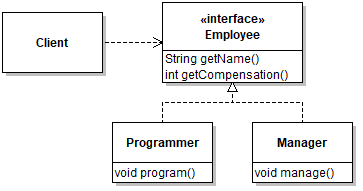
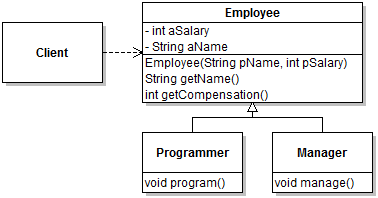
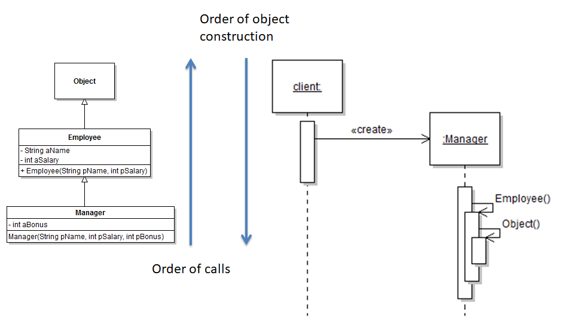
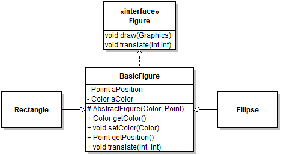
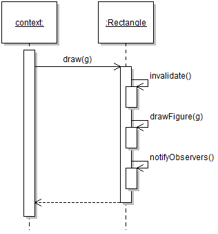

## Module 7 - Inheritance

## Description

*Inheritance* is a programming language-supported mechanism that allows us to assemble state and computation from different classes into a single object. It is a powerful feature that offers a natural solution to many design problems related to code extensibility and dynamic configuration. At the same time, it is a complex mechanism that can all too easily be misused. In this module, I will offer a review of inheritance and present the major design rules and patterns involving it.

## Learning Objectives

After this module you should:

* Have a deep understanding of the motivation for and conceptual foundations of inheritance;
* Be able to create class hierarchies that involve inheritance;
* Know about common problems with inheritance and how to avoid them;
* Be able to use the Template Method Design Pattern effectively;

## Notes

### Review of Inheritance

So far we have seen many situations where we can leverage polymorphism to realize various design features. Generally speaking polymorphism makes a design *extensible* and *reusable*. For example, the small design below is extensible because it is possible to add new types of employees without disrupting the existing design. Similarly, features that work with one type of employee can be reused on other types of employees.



However, one limitation of this design becomes immediately apparent when we try to implement it. In this design, the root of the type hierarchy is an interface, so it defines services without providing an implementation for them. However, the kinds of services it defines, such as being able to return a name for an employee, are likely to be implemented in an identical way in each class. For example:

```java
public class Programmer implements Employee
{
   private String aName;
   private int aSalary;
   ...
	
public class Manager implements Employee
{
   private String aName;
   private int aSalary;
   private int aBonus;	
   ...
```

So here we can say that the design induces *code duplication*, which is generally not desirable. There is an extensive 
literature on the topic of [code clones](https://en.wikipedia.org/wiki/Duplicate_code), but the bottom line is that they should be avoided.

One programming language mechanism readily available to avoid code duplication is *inheritance*. In Java and similar languages, inheritance allows programmers to define a class (the subclass) with respect to a base class (or superclass). This avoids repeating declarations of class members, since the declarations of the base class will be automatically taken into account when creating instances of the subclass.



In UML, inheritance is denoted by a *solid line* with a white triangle pointing from the subclass to the superclass. In Java the subclass-superclass relation is declared using the `extends` keyword:

```java
public class Manager extends Employee
{
   private int aBonus;
```

To understand the effect of inheritance on a program, it's important to remember that a class is essentially a *template for creating objects*. Defining a subclass (e.g., `Manager`) as an extension of a superclass (e.g., `Employee`) means that when objects of the subclass are instantiated, the objects will be created by using all the declarations of the subclass and all of its superclasses. The result will be a *single* object. The run-time type of this object will be the type specified in the `new` statement. However, just like interface implementation, inheritance induces a suptyping relation. For this reason, an object can always be assigned to a variable of any of its superclasses (in addition to its implementing interfaces):

```java
Employee alice = new Manager();
```

In the code above, a new object of (run-time) type `Manager` is created and assigned to a variable named `alice` of (compile-time) type `Employee`. This is legal because `Manager` is a subtype of `Employee`, just as in the initial case with the interface. Note that when an instance of `Manager` is assigned to a variable of type `Employee`, it does not "become" an employee or "lose" any of the manager-specific fields. In Java, once an object is created, its run-time type remains unchanged, and in this example it would be possible to safely assign the object back to a variable of type `Manager`:

```java
Manager manager = (Manager) alice;
```

In this module, the distinction between **compile-time** type and **run-time** type will become increasingly important. The run-time type of an object is the (most specific) type of an object when it is instantiated. It is the type mentioned in the `new` statement, and the one that is represented by the object returned by method `getClass()`. The run-time type of an object never changes for the duration of the object's life-time. In contrast, the compile-time (or static) type of an object is the type of the *variable* in which an object is stored at a particular point in the code. In a correct program the static type of an object can correspond to its run-time type, or to any supertype of its run-time type. The static type of an object can be different at different points in the program, depending on the variables in which an object is stored. Consider the following example:

```java
1  public static boolean isManager(Object pObject)
2  {
3     return pObject instanceof Manager;
4  }
5
6  public static void main(String[] args)
7  {
8     Employee alice = new Manager();
9     Manager manager = (Manager) alice;
10    boolean isManager1 = isManager(alice);
11    boolean isManager2 = isManager(manager);
12 }
```

Here at line 8 an object is created that is of run-time type `Manager` and assigned to a variable of (static) type `Employee`. As stated above, the run-time type of this object remains `Manager` throughout the execution of the program. However, at line 9 the static type of the object is `Manager`, and at line 3 it is `Object` (a formal parameter is a kind of variable, so the type of a parameter acts like a type of variable).

### Inheriting Fields

With inheritance, the subclass *inherits* the declarations of the superclass. Conceptually, the consequences of inheriting field declarations are quite different from those of method declarations, so we will discuss these separately.

Field declarations define state held by the instantiated object. When creating a new object, the object created will have a field for each field declared in the class named in the `new` statement, and each of its superclass, transitively. Given the following class hierarchy:

```java
class Employee
{
   private String aName;
   private int aSalary;
   ...
   
class Manager extends Employee
{
   private int aBonus;
   ...
```

object created with the statement:

```
new Manager(...);
```

will have three fields: `aName`, `aSalary`, and `aBonus`. Note that it does not matter that the fields are private. Accessibility is a *static* concept: it is only relevant to the source code. The fact that the code in class `Manager` cannot see (or access) the fields declared its superclass does not change anything to the fact that these fields are inherited. For the fields to be accessible in subclasses, it is possible to declare them `protected` or to access their value through an accessor method (a.k.a. "getter"). In Java, type members declared to be `protected` are only accessible within methods of the same class, classes in the same package, and subclasses in any package.

The inheritance of fields creates an interesting problem of data initialization. When an object can be initialized with default values, the process is simple. In our case, if we assign the default values as follows:

```java
class Employee
{
   private String aName = "Anonymous";
   private int aSalary = 0;
   ...
   
class Manager extends Employee
{
   private int aBonus = 0;
   ...
```

We can expect that creating a new instance of class `Manager` will result in an instance with three fields with the specified values. However, it is often the case that object
initialization requires input data (e.g., an actual name for the employee and/or manager). In this case it becomes important to pay attention to the order in which the fields of an object are initialized. The general principle is that (in Java) the fields of an object are initialized "top down", from the field declarations of the most general superclass down to the specific class named in the `new` statement. In our example, `aName` would be initialized, then `aSalary`, and then `aBonus`. This order is achieved simply by the fact that the first instruction of any constructor is to call the constructor of its superclass, and so on. For this reason, the order of constructor calls is "bottom up".



In Java, it is important to know that if *no constructor is declared*, a default constructor with no parameter is invisibly made available. For this reason, the fact that the first line
of any constructor is the call to the super-constructor can be *implicit*. In the running example, declaring:

```java
class Manager extends Employee
{
   private int aBonus = 0;
   
   public Manager(int pBonus)
   { // Automatically calls super()
      aBonus = pBonus.
```

means that the default constructor of `Employee` is called and terminates before the code of the proper `Manager` constructor executes. With this constructor chain, it then becomes
relatively easy to pass input values "up" to initialize fields declared in a superclass. For example:

```java
class Employee
{
   private String aName = "Anonymous";
   private int aSalary = 0;
   
   public Employee(String pName, int pSalary)
   {
      aName = pName;
      aSalary = pSalary;
   }
   ...
   
class Manager extends Employee
{
   private int aBonus = 0;
  
   public Manager(String pName, int pSalary, int pBonus)
   {
      super(pName, pSalary);
      aBonus = pBonus;
```

Here the first line of the `Manager` constructor is an *explicit* call to the constructor of the superclass, that passes in the initialization data. This explicit call is now
actually required, because declaring a non-default constructor in `Employee` disables the automatic generation of a default constructor. Once the `super` call terminates, the
initialization *of the same object* continues with the assignment of the `aBonus` field. Note that calling the constructor of the superclass with `super()` is *very different* from 
calling the constructor of the superclass with a `new` statement. In the latter case, two different objects are created. The code:

```java
   ...
   public Manager(String pName, int pSalary, int pBonus)
   {
      new Employee(pName, pSalary);
      aBonus = pBonus;
   }
```

calls the default constructor of `Employee` (if available), then creates a new `Employee` instance, different from the instance under construction, 
immediately discards the reference to this instance, and then completes the initialization of the object. This code is problematic.

### Inheriting Methods

Inheriting methods is different from fields because method declarations don't change anything to the state held by an object, and so don't involve any data initialization of an object. Instead, the inheritance of methods centers around the question of *applicability*. By default, methods of a superclass are applicable to instances of a subclass. For example, if we define a method `getName()` in `Employee`, it will be possible to call this method on an instance of `Manager`:

```java
Manager manager = new Manager(); // Inherits from Employee
manager.getName();
```

This "feature" is nothing special, and really is only a consequence of what a method represents and the rules of the type system. Remember that an instance method is just a different way to express a function that takes an object of its declaring class as its first argument. For example, the method `getName()` in `Employee`:

```java
class Employee
{
   private String aName = ...;

   public String getName()
   {
      return this.aName;
   }
}
```

is more or less equivalent to the static method:

```java
class Employee
{
   public static String getName(Employee pThis)
   {
      return pThis.aName;
   }
}
```

In the first case the function is invoked by specifying the target object *before* the call: `employee.getName()`. In this case we refer to the `employee` parameter as the *implicit parameter*. A reference to this parameter is accessible through the `this` keyword within the method. In the second case the function is invoked by specifying the target object as an *explicit* parameter, so *after* the call: `getName(employee)`. In this case to clear any ambiguity it is usually necessary to specify the type of the class where the method is located, so `Employee.getName(employee)`. What this example illustrates, however, is that methods of a superclass are automatically *applicable* to instances of a subclass because instances of a subclass can be assigned to a variable of any supertype. Because it is legal to assign a reference to a `Manager` to a parameter of type `Employee`, the `getName()` method is applicable to instances of any subclass of `Employee`.

In some cases, the methods inherited from a superclass do not quite do what we want. Assume that in our running example class `Employee` has a method `getCompensation()`:

```java
class Employee 
{
   private protected aSalary = ...;
   ...
   public int getCompensation() { return aSalary; }
```

If in our problem space the compensation of a manager is their salary plus a bonus, the inherited method `getCompensation()` will not quite do what we want: the bonus will be missing. In such cases, it is usual to *redefine* or *override* the behavior of the inherited method by supplying an implementation in the subclass that only applies to instances of the (more specific, less general) subclasses. For example:

```java
class Manager extends Employee 
{
   private int aBonus = ...;
   ...
   public int getCompensation() 
   {
      return aSalary + aBonus; 
   }
```

In this example, although the field `aSalary` is declared in the superclass `Employee`, it is accessible to methods of the subclass `Manager` because it is declared as `protected`. If this field had been declared `private`, the code would not compile to due an access violation, as discussed below.

Overriding inherited methods has a major consequence on the design of an object-oriented program, because it introduces the possibility that multiple method implementations apply to an object that is the target of a method invocation. For example, in the code:

```java
int compensation = new Manager(...).getCompensation();
```

both `Employee.getCompensation()` and `Manager.getCompensation()` are applicable and can thus legally be used. How to choose? For the program to work, the programming environment (the JVM) must follow a consistent *method selection algorithm*. For overridden methods, the selection algorithm is relatively intuitive: when multiple implementations are applicable, the run-time environment selects the *most specific one* based on the *run-time type of the implicit parameter*. Again, the run-time type of an object is the "actual" class that was instantiated: the class name that follows the `new` keyword, or the class type represented by the object returned by a call to `Object.getClass()`. Because the selection of an overridden method relies on run-time information, the selection procedure is often referred to as *dynamic dispatch*, or *dynamic binding*. It is important to remember that type information in the source code is completely overlooked for dynamic dispatch. So, in this example:

```java
Employee employee = new Manager(...);
int compensation = employee.getCompensation();
```

the method `Manager.getCompensation()` would be selected, even though the static (compile-time) type of the target object is `Employee`.

In some cases it is necessary to by-pass the dynamic binding mechanism and link to a specific, statically-predictable method implementation. In Java however, for instance methods it is only possible to do so by referring to the implementation of a method that is being directly overridden. This exception to the usual dynamic binding mechanism is intended to support the common case where a method is overridden to provide behavior *in addition* to what the original method does. To illustrate this case in our `Manager`-`Employee` scenario, consider a variant of the design where field `aSalary` in `Employee` would be `private`. In this case redefining `getCompensation` in `Manager` is tricky, since a reference to `aSalary` would result in a compile-time access violation:

```java
class Manager extends Employee 
{
   private int aBonus = ...;
   ...
   public int getCompensation() 
   {
      // Cannot be replaced with return getCompensation() + aBonus;
      return aSalary + aBonus; 
   }
```

In the revised design the only way to access the value of `aSalary` is to call method `getCompensation()` on an object of type `Employee` (or a subtype). In the case where the run-time type of the object is `Manager`, however, this will result in a stack overflow, since the method would recursively call itself without a termination condition.

The solution is to refer to the *specific implementation* of `getCompensation()` in class `Employee`. To do so we use the keyword `super` followed by a method name:

```java
public int getCompensation() 
{
   return super.getCompensation() + aBonus; 
}
```

### Overloading Methods

As we saw above, overriding methods allows programmers to declare different versions of the same method, so that the most appropriate method will be selected at run-time based on the run-time type of the implicit parameter. Many programming languages (including Java) support another mechanism for specifying different implementations of the "same" method, this time by selecting the method based on the type of the *explicit* parameters. This mechanism is known as **overloading**. A typical example of overloading can be found in [math libraries](https://docs.oracle.com/javase/8/docs/api/java/lang/Math.html), which provide basic functions such as `abs` (absolute value) for arguments of different primitive types, such a `int` and `float`. Another typical application of overloading is for constructors (e.g., a default constructor and a constructor taking various arguments).

The important thing to know about overloading is that the selection of a specific overloaded method is based on the *static* type of the *explicit arguments*. The selection procedure is to find all *applicable* methods and to select the *most specific* one. Although overloading provides a convenient way to organize small variants of a general computation, the use of this mechanism can easily lead to hard-to-understand code, and I recommend not overloading methods except for widely used idioms (such as constructor overloading or library methods that support different primitive types).

### Abstract Classes

Inheriting class member declarations helps us avoid code duplication. However, there are often situations where locating common class members into a single superclass leads to a class declaration that it would not make sense to instantiate. For example, the small design below is for a graphical editor. The design represents how different geometric figures can be represented in the software.  



Because all figures have a position and a color, it makes sense to group all the related functionality into a common superclass `BasicFigure`. However, because `BasicFigure` implements the `Figure` interface, it must supply an implementation for all of the interface's methods, including `draw`. But how should we draw a `BasicFigure`? Here, even the idea of using some sort of default behavior seems questionable, because `BasicFigure` represents a purely abstract concept that needs to be refined to gain concreteness. This design situation is directly supported by the *abstract class* feature of a programming language. Technically, an abstract class represents a correct but incomplete set of class member declarations.

In Java a class can be declared abstract by including the reserved word `abstract` in its declaration. It is also common practice to prefix the identifier for an abstract class with the word `Abstract`. Hence, in our design the `BasicFigure` would be declared: `public abstract AbstractFigure implements Figure`.

Declaring a class `abstract` has three main consequences:

* The class cannot be instantiated, which is checked by the compiler.

* The class no longer needs to supply an implementation for all the methods in the interface(s) it declares to implement. This relaxing of the interface contract is type-safe because the class cannot be instantiated. However, any concrete (non-abstract) class will need to have implementations for all required methods.

* The class can declare new `abstract` methods, using the same `abstract` keyword, this time placed in front of a method signature. For example, adding `protected abstract Rectangle boundingBox();` within `AbstractFigure` will add a new abstract method to the class. Abstract methods are sometimes necessary to specify behavior that is required by the concrete methods of the abstract class, but whose implementation requires information that is only available in subclasses. The section on the Template Method design pattern, below, provides a detailed illustration of this scenario. From a program construction point of view, abstract methods work just like interface methods: any concrete subclass must provide an implementation for them to be instantiable.

Note that because abstract classes cannot be instantiated, their constructor can only be called from within the constructors of subclasses. For this reason it makes sense to declare the constructors of abstract classes `protected`.

### Template Method Design Pattern

One not uncommon situation with inheritance is where some code is common for all subclasses, except for some small parts of an algorithm that vary from subclass to subclass. Because parts of the code is common, it will benefit from being "moved up" to the superclass so that it can be reused and so that the design is robust to errors caused by inconsistently re-implementing common behavior. However, because the code needs information from subclasses, it cannot be completely implemented in the superclass. The solution to this problem is to put all the common code in the superclass, and to define some "hooks" to allow subclasses to provide specialized functionality where needed. This idea is called the **Template Method design pattern**. The name relates to the fact that the common method in the superclass is a "template", that gets "instantiated" differently for each subclass. The "steps" are defined as non-private (so overridable) methods in the superclass. 

Let's illustrate the situation with the example of `Figure.draw(Graphics)`, from the design in the above section. Assume that in that particular design, a figure is observable (in the sense of the Observer design pattern), and drawing a figure involves three three steps:

1. Invalidating the bounding box for the figure (so the canvas can be efficiently refreshed);
2. Actually drawing the figure (using graphics primitives such as `drawLine`, etc.);
3. Notifying observers that the figure was drawn.

Here the first and last steps *should always happen in the same way*, but obviously the second step will depend on the actual concrete figure. To realize a solution, we capture the first and third steps as private methods in `AbstractFigure` (`BasicFigure` on the diagram). Assume that the code to complete these two operations can be entirely written in the superclass. The code of the `AbstractFigure` class would thus start to look like:

```java
public AbstractFigure implements Figure
{
   private void invalidate() { /* Invalidate the bounding box */ }
   private void notifyObservers() { /* Call callback on all observers */ }

   public void draw(Graphics pGraphics)
   {
      invalidate();
      // Complete the drawing
      notifyObservers();
   }
```

The only remaining question is, how can we complete this code? The solution is to use an *abstract* method to make the code compile but delegate the implementation to subclasses. We would therefore add the following declaration within `AbstractFigure`:

```java
   protected abstract void drawFigure(Graphics pGraph);
```

which allows us to finish the code of `draw` so it compiles properly:

```java
public final void draw(Graphics pGraphics)
{
   invalidate();
   drawFigure(pGraphics);
   notifyObservers();
}
```

The implementation of the pattern will then need to be completed by concrete subclasses, which will have to supply an implementation for `drawFigure` that actually draws the figure on the graphics context.

The following are important to note about the use of the Template Method design pattern:

* The method in the abstract superclass is the *template* method, it calls the concrete and abstract *step methods*;
* If it is important that in a design the algorithm embodied by the template method be fixed, it could be a good idea to declare the template method `final`, so it cannot be overridden (and thus changed) in subclasses;
* It's important that the abstract step method has a different name from the template method for this design to work. Otherwise, the template method would recursively call itself, leading to a stack overflow;
* The most likely access modifier for the abstract step methods is `protected`, because in general there will likely not be any reason for client code to call individual steps that are intended to be internal parts of a complete algorithm. Client code would normally be calling the template method.
* The "steps" that need to be customized by subclasses do not necessarily need to be abstract. It some cases, it will make sense to have a reasonable default behavior that could be implemented in the superclass. In this case it might not be necessary to make the superclass abstract.

When first learning to use inheritance, the calling protocol between code in the super- and subclasses can be a bit confusing because, although it is scattered over multiple classes, the method calls are actually on the *same target object*. The following sequence diagram illustrates a call to `draw` on a hypothetical `Rectangle`. As can be seen, although it is implemented in subclasses, the call to the abstract step method is a self-call.



### Proper Use of Inheritance

Inheritance is *both* a code reuse and an extensibility mechanism. This means that a subclass both inherits the declarations of its superclasses, but also becomes a subtype of the superclasses. To avoid major design flaws, inheritance should only be used for *extending* the behavior of superclasses. As such, it is incorrect to use inheritance to **limit or restrict** the behavior of the superclass, and/or to use inheritance **when the subclass is not a proper subtype** of the superclass.

A classic example of using inheritance incorrectly by limiting the behavior of the superclass is the so-called [Circle-ellipse problem](https://en.wikipedia.org/wiki/Circle-ellipse_problem), wherein a class to represent a circle is defined by inheriting from an `Ellipse` class and preventing clients from creating any ellipse instance that does not have equal proportions. The issue with this idea is that services that were available on instances of the superclass (ellipse) must become "invalid" or "unsupported" if the run-time instance happens to be of the subtype `Circle`:

```java
Ellipse ellipse = getEllipse();
ellipse.setHeight(ellipse.getWidth()*2); // Not possible if ellipse is an instance of Circle
```

This intuition is captured by the [Liskov substitution principle](https://en.wikipedia.org/wiki/Liskov_substitution_principle), which basically states that subclasses should not restrict what clients of the superclass can do with an instance. Specifically, this means that methods of the subclass:

* Cannot have stricter preconditions;
* Cannot have less strict post-conditions;
* Cannot take more specific types as parameters;
* Cannot make the method less accessible (e.g., public -> protected);
* Cannot throw more checked exceptions;
* Cannot have a less specific return type.

Somewhat related is the issue of (mis)using inheritance when composition should be used. Citing [Effective Java, 2nd Edition](https://www.safaribooksonline.com/library/view/effective-java-2nd/9780137150021/):

> Inheritance is appropriate only in circcumstances where the subclas really is a *subtype* of the superclass. In other words, a class B should only extend a class A if an "is-a" relationship exists between the two classes.

Some obvious (and acknowledged) violations of this principle include `java.util.Stack` (which inappropriately inherits from `Vector`), and `java.util.Properties` (which inappropriately inherits from `Hashtable`).

## Reading

* [Java Tutorial on Inheritance](https://docs.oracle.com/javase/tutorial/java/IandI/subclasses.html)
* JetUML v1.0 The class hierarchy rooted at interface [Node](https://github.com/prmr/JetUML/blob/v1.0/src/ca/mcgill/cs/stg/jetuml/graph/Node.java)

## Exercises

1. A bike courier company uses a Scheduler system to schedule bikers for delivery based on various factors (unimportant for this practice question). The company wants the flexibility to install different scheduling algorithms. However, all scheduling algorithms should follow these steps: (a) check if at least one biker is available, and if not throw an exception; (b) schedule a biker using a given algorithm; (c) notify interested observers that a biker was scheduled. Operations (a) and (c) are the same for all algorithms, but should be isolated in separate methods. Concrete schedulers should also have the flexibility to throw algorithm-specific types of exceptions if they cannot fulfill a scheduling request. Assume all exceptions for this design are checked. Complete the following UML class diagram to provide a design for these requirements. Use the TEMPLATE METHOD design pattern. When relevant to the design, make sure to include the appropriate modifiers for methods and/or classes (`final`, `public`, `protected`,`private`, `abstract`, etc.). Illustrate support for two different scheduling algorithms. Include the OBSERVER mechanism for biker notification. Write the code necessary to implement the relevant parts of your design.

---

<a rel="license" href="http://creativecommons.org/licenses/by-nc-nd/4.0/"></a>

Unless otherwise noted, the content of this repository is licensed under a <a rel="license" href="http://creativecommons.org/licenses/by-nc-nd/4.0/">Creative Commons Attribution-NonCommercial-NoDerivatives 4.0 International License</a>. 

Copyright Martin P. Robillard 2017