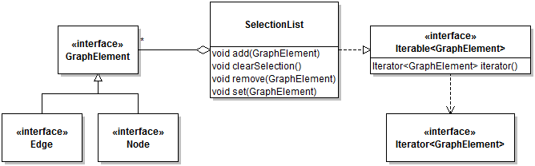

# Module 2 - Answers

Answers and answer sketches to the Module 2 practice exercises.

## Exercises 1, 2, 3, 4, and 8

The code can be found [here](Hand.java). 

## Exercise 5

**Hints:** Your comparator class should have a field of an enumerated type, a way to set the value of the field, and use this value in the `compare` method.

## Exercise 6

You can also clone the [Solitaire GitHub repo](https://github.com/prmr/Solitaire) and delete the Java files to give yourself a fresh start.

## Exercise 7

Sample answers can be found in the [Solitaire GitHub repo](https://github.com/prmr/Solitaire). Note that in my solution I bypassed the creation of individual `SuitStack` classes and managed everything through a single `SuitStackManager`. However, it's not a bad idea to try it as suggested first.

## Exercise 9

Since this is a model, small variants are possible. For example, the model would also be correct and useful without the interfaces `Edge` and `Node`. I added them because I thought that was a neat way to answer the question "What is a `GraphElement`?". I also only included a subset of the methods in `SelectionList` which I thought gave the best idea of how the class "worked", and left out a bunch of state querying methods.

