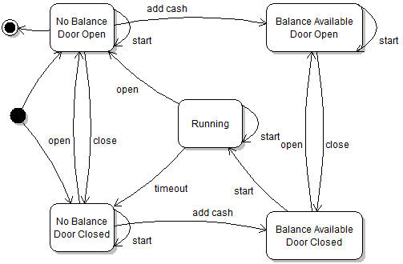
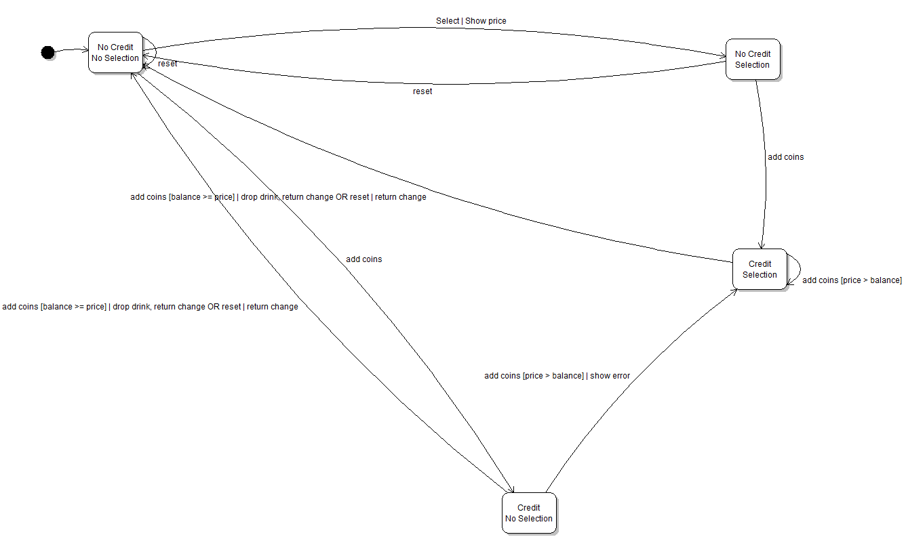

# Module 3 - Answers

Answers and answer sketches to the Module 3 practice exercises.

## Exercise 1

The key insight here is that the state of the door (open or closed) needs to be reflected in the modeled abstract states. Note that the state diagram captures information on how the "start" button works. Because every state has a transition labeled "start", it means it's always possible to press the "start" button, it simply happens to do nothing except in the case where there's a balance and the door is closed. Not including the "start" self-transitions would actually be a different specification for the machine. It would mean that it is physically impossible to press the button except when it can start the machine (in the sense that the button is mechanically blocked or something). Assuming whoever uses the machine actually wants to get their dry laundry back, it makes sense to include an end state.

## Exercise 2

## Exercise 3

See the implemented [Card](https://github.com/prmr/Solitaire/blob/v0.3/src/ca/mcgill/cs/stg/solitaire/cards/Card.java) class. Note that there are different ways to implement the flyweight collection. In class I showed a version using lazy initialization of a double hash table.