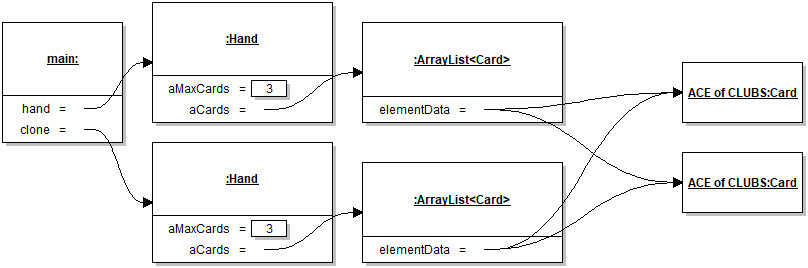

# Module 5 - Answers

Answers and answer sketches to the Module 5 practice exercises.

## Exercise 1


Note that the diagram skips over the initialization of the two `String` objects, which in any case is done under the covers by the compiler because of the use of string literals. It's also interesting to note that the object referenced by `string2` does *not* participate in the sequence at the level of abstraction modeled here. Finally, detailed calls to library methods 
are not normally part of sequence diagrams, but here it was interesting to show what the common `println` statement maps to. 

## Exercise 2


Things to note from this diagram:

* The use of the somewhat "fake" `client` object provides a nice way to provide the context of the object sequence (that is, where the sequence occurs in the code);
* The diagram does not include any detailed code logic, for example the fact that the bottom part of the sequence only occurs if `isEmpty()` returns `false`. That is not the point of a model. People who need that level of detail should look at the code directly.
* The appropriate use of names really increases the clarity of the model. For example, here I annotated the return edge with the label `topMove`, then gave this name to the object of type `Move`. From this it should be fairly clear that it's the top move that's being undone, without having to rely of diagram notation.

## Exercise 3


With this question we finally reached a level of complexity where the value of UML models starts to become more apparent. Here with a minimum of experience a developer would be able to see from the left of the diagram that the `EditorFrame` takes care for a bunch of object navigation and access, and from the right of the diagram that that actual `cut` functionality is realized through a close collaboration between an instance of `GraphPanel` and an instance of `Clipboard`.

## Exercise 4

The class must be declared to implement `Cloneable`, and supply a `clone` method. Here we assume that
it's acceptable to make a shallow copy of the card objects, since they are immutable and either unique or systematically tested 
for equality using `equals`. It would also have been a correct answer to deep-copy the card objects, since the design
does not require them to be unique.

```java
public class Hand implements Iterable<Card>, Cloneable
{
   ...
   @Override
   public Hand clone()
   {
      try
      {
         Hand clone = (Hand) super.clone();
         clone.aCards = new ArrayList<>();
         for( Card card : aCards )
         {
            clone.add(card);
         }
         return clone;
      }
      catch(CloneNotSupportedException e)
      {
         return null;
      }
   }
```



## Exercise 5

Here a deep copy of the decorated object is required, otherwise there would be two distinct decorators
decorating the same object. To achieve multi-decoration, the proper way is to nest decorators.

```java
@Override
public ConferenceShow clone()
{
   try
   {
      ConferenceShow clone = (ConferenceShow) super.clone();
      clone.aDecorated = aDecorated.clone();
      return clone;
   }
   catch (CloneNotSupportedException e)
   {
      return null;
   }
}
```

## Exercise 6

Here I chose to create a separate class for the `CompositeCommand`, since there is no issue with leaking references if they
are already well-encapsulated into the component commands.

```java
public class CompositeCommand implements Command
{
   private List<Command> aCommands = new ArrayList<>();
	
   public CompositeCommand(Command... pCommands )
   {
      for( Command command : pCommands )
      {
         aCommands.add(command);
      }
   }
	
   @Override
   public void execute()
   {
      for( Command command : aCommands )
      {
         command.execute();
      }
   }
}
```

The final piece is to implement a factory for different types of composite commands, for example a `resetAndAdd` command:

```java
public class Program
{
   // Some code

   public void resetAndAdd(Show pShow, Day pDay)
   {
      assert pShow != null && pDay != null;
      Command command = new CompositeCommand(
            () -> Arrays.fill(aShows, NullShow.DEFAULT),
            () -> aShows[pDay.ordinal()] = pShow.clone());
      aCommands.add(command);
      command.execute();
   }
```

## Exercise 7

We define a decorator class as follows:

```java
public class LoggedCommand implements Command
{
	private final Command aCommand;
	private final String aMessage;
	
	public LoggedCommand(Command pCommand, String pMessage)
	{
		aCommand = pCommand;
		aMessage = pMessage;
	}

	@Override
	public void execute()
	{
		aCommand.execute();
		// Decoration
		System.out.println(String.format("Executed command %s", aMessage));				
	}
}
```

and to log a certain command, we wrap it as follows:

```java
public class Program
{
   // Some code

   public void add(Show pShow, Day pDay)
   {
      assert pShow != null && pDay != null;
      Command command = new LoggedCommand(() -> aShows[pDay.ordinal()] = pShow.clone(), "ADD");
      aCommands.add(command);
      command.execute();
   }
```

Here, overriding `toString()` in the various classes in the sample code would open up a whole range of possibilities 
for logging commands with more useful information.
