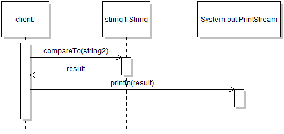
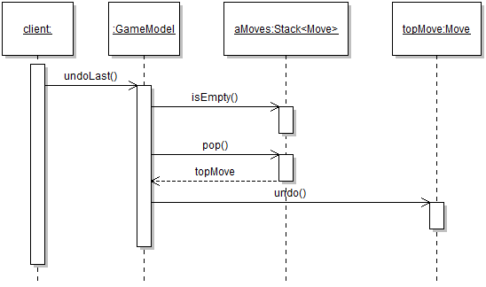
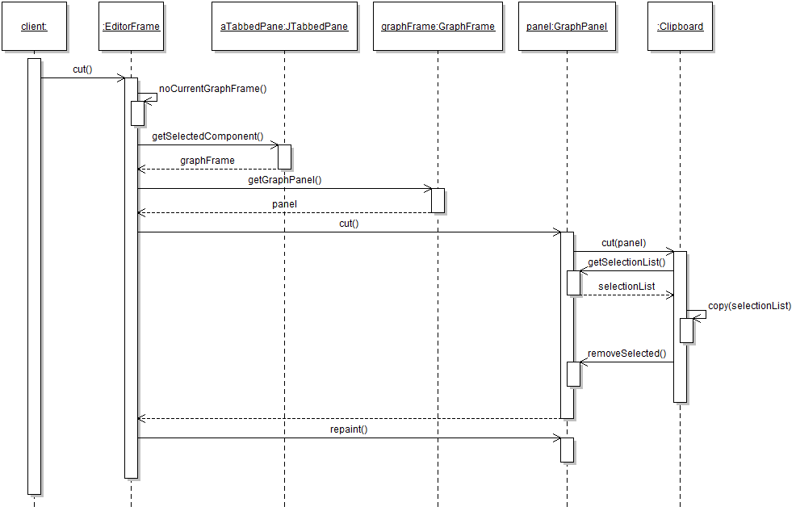

# Module 5 - Answers

Answers and answer sketches to the Module 5 practice exercises.

## Exercise 1

Note that the diagram skips over the initialization of the two `String` objects, which in any case is done under the covers by the compiler because of the use of string literals. It's also interesting to note that the object referenced by `string2` does *not* participate in the sequence at the level of abstraction modeled here. Finally, detailed calls to library methods 
are not normally part of sequence diagrams, but here it was interesting to show what the common `println` statement maps to. 

## Exercise 2

Things to note from this diagram:

* The use of the somewhat "fake" `client` object provides a nice way to provide the context of the object sequence (that is, where the sequence occurs in the code);
* The diagram does not include any detailed code logic, for example the fact that the bottom part of the sequence only occurs if `isEmpty()` returns `false`. That is not the point of a model. People who need that level of detail should look at the code directly.
* The appropriate use of names really increases the clarity of the model. For example, here I annotated the return edge with the label `topMove`, then gave this name to the object of type `Move`. From this it should be fairly clear that it's the top move that's being undone, without having to rely of diagram notation.

## Exercise 3

With this question we finally reached a level of complexity where the value of UML models starts to become more apparent. Here with a minimum of experience a developer would be able to see from the left of the diagram that the `EditorFrame` takes care for a bunch of object navigation and access, and from the right of the diagram that that actual `undo` functionality is realized through a close collaboration between an instance of `GraphPanel` and an instance of `Clipboard`.